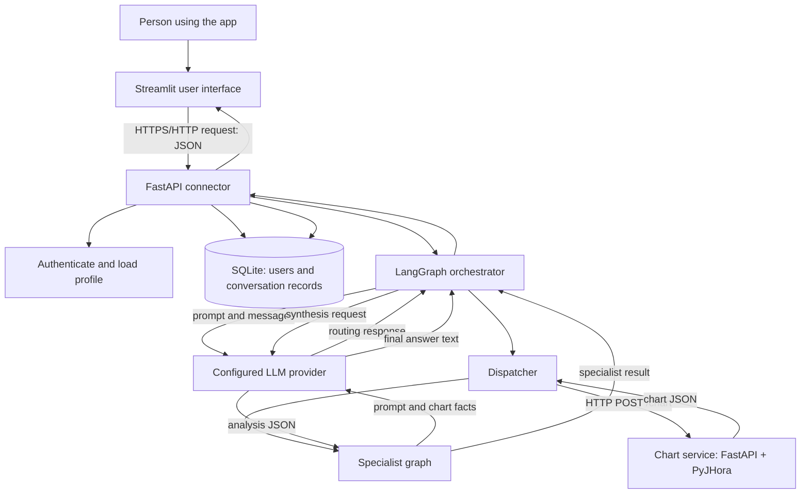

# AstroWeave, Explained

## A visual, beginner-first tour of the application

**For:** readers who are new to this codebase, Python, APIs, graphs, and LLM applications
**How to read:** follow the chapters in order, or jump to the question that brought you here
**Accuracy rule:** this book describes the implementation present in the repository. A box marked **NOW** exists in code; **NOT YET** means a design idea is not active at runtime.

> **The one-sentence picture:** AstroWeave is a Python web application where a connector receives a user's question, a LangGraph workflow coordinates specialist LLM calls, a separate HTTP service calculates chart data, and SQLite stores accounts and conversations.

## The reading map

```mermaid
flowchart LR
    A["01 Orientation"] --> B["02 One request"]
    B --> C["03 Python foundations"]
    C --> D["04 Graphs and data"]
    D --> E["05 LLMs and prompts"]
    E --> F["06 Tools and handoffs"]
    F --> G["07 Chart service"]
    G --> H["08 Accounts and history"]
    H --> I["09 Tests and operations"]
    I --> J["10 Guided source tour"]
```

| Chapter | The question it answers |
|---|---|
| [01. Orientation](book/01-orientation.md) | What are the parts of the project, and how do they fit together? |
| [02. One Request, Step by Step](book/02-one-request.md) | What happens from clicking Submit to seeing an answer? |
| [03. Python Foundations](book/03-python-foundations.md) | What do functions, objects, decorators, dictionaries, and exceptions mean in this code? |
| [04. Graphs and Shared Data](book/04-graphs-and-state.md) | What is a LangGraph node, edge, state, context, stage, and reducer? |
| [05. LLM Calls and Prompts](book/05-llms-and-prompts.md) | What is sent to a model, how is its answer parsed, and who controls the flow? |
| [06. Tools and Handoffs](BEGINNER_GUIDE.md) | How can a Python function become a tool, and is a specialist LLM calling one today? |
| [07. Chart Service and HTTP](book/07-chart-service.md) | How does chart data cross the process boundary and return to a specialist? |
| [08. Accounts, Security, and Memory](book/08-accounts-and-history.md) | Where are identity and conversations stored, and how are requests protected? |
| [09. Tests and Running the Project](book/09-testing-and-operations.md) | How do developers check behavior, start services, and diagnose common failures? |
| [10. Read the Source with Me](book/10-source-tour.md) | In what order should a new reader open files and follow symbols? |

## Start with this picture

Follow the arrows as messages and data, not as invisible thoughts. Python code initiates each call. The LLM returns text or structured data; it does not run inside the Python process. A web request is not a Python function call. A LangGraph graph invocation is not a tool invocation. Chapter 06 unpacks those easily confused terms.

## Three ground rules

1. **Names are not behavior.** A class named `Agent`, a graph node named `planner`, or a registry entry named `career_role_fit` only does what the code that uses it actually does.
2. **Follow the caller.** To understand a function, find the exact Python expression that calls it, then follow its arguments and return value.
3. **Separate implemented from planned.** A type or state field can reserve space for future behavior. Its existence alone does not prove that behavior runs.

## Current implementation landmarks

| Capability | Status in this repository |
|---|---|
| Streamlit UI and FastAPI connector | Implemented |
| Authenticated requests and SQLite transcripts | Implemented |
| LangGraph orchestration and specialist workflows | Implemented |
| LLM-powered routing, specialist analysis, and synthesis | Implemented; provider/model selected by configuration |
| Separate chart-calculation HTTP service | Implemented |
| Registered specialist prompt descriptions | Implemented; not currently consumed by the specialist executor |
| Python `FunctionTool` wrapper | Implemented and unit tested for direct Python calls |
| LLM choosing a registered specialist function and receiving its result | **Not yet implemented** |
| Retrieval-augmented knowledge (RAG) and deterministic Vedic/KP analysis engines | **Not yet implemented** |

## If you have only ten minutes

Read [02. One Request, Step by Step](book/02-one-request.md), then [04. Graphs and Shared Data](book/04-graphs-and-state.md), then [06. Tools and Handoffs](BEGINNER_GUIDE.md). These chapters answer: what calls what, how work moves through the system, and whether a model directly calls Python here.

## If you are learning to read source code

Start with [03. Python Foundations](book/03-python-foundations.md). Keep [10. Read the Source with Me](book/10-source-tour.md) open beside your editor. The source links use repository-relative paths and are intended to take you directly to the implementation.

## Source of truth and maintenance

This book is explanatory, not executable documentation. Current code decides runtime behavior. The canonical engineering reference is [PROJECT_DOCUMENTATION.md](PROJECT_DOCUMENTATION.md); it covers contracts, configuration, deployment, and implementation status in a more compact form. When behavior changes, update the relevant chapter and canonical reference together.
