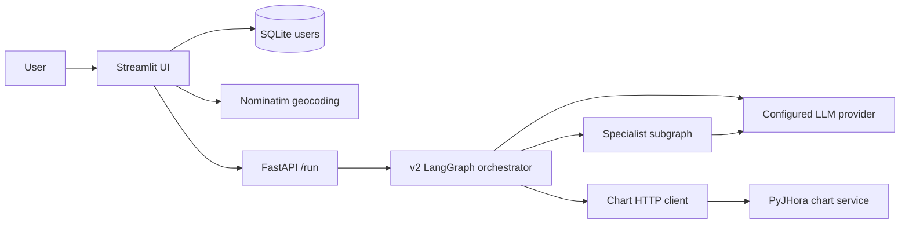
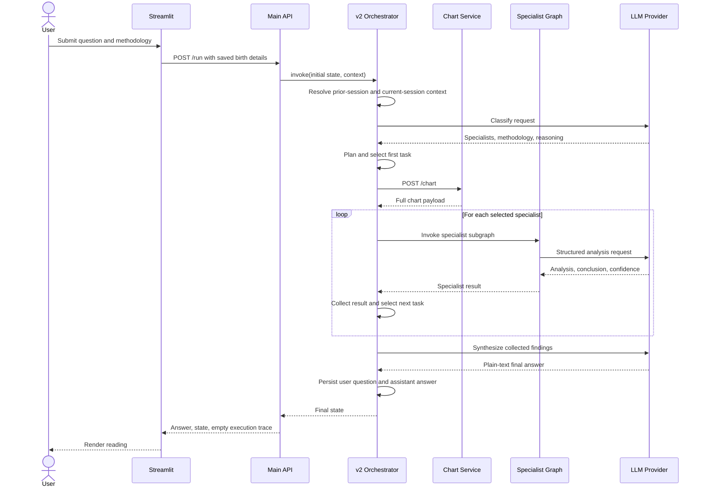
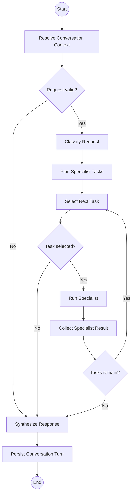
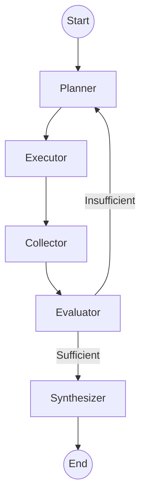

# AstroWeave Project Documentation

**Document status:** Living engineering reference  
**Application generation:** v2 queue-driven orchestrator  
**Last verified:** 2026-09-20  
**Production readiness:** Prototype; not production-ready

## 1. Purpose of This Document

This is the canonical functional and technical reference for AstroWeave. It is
intended for product planning, engineering, testing, operations, security
review, onboarding, and future agent-assisted development.

This document distinguishes among:

- **Implemented:** behavior present in the current source code.
- **Placeholder:** a named architectural boundary that exists but does not yet
  provide its intended behavior.
- **Planned:** a direction represented in the repository or product design but
  not implemented.

When this document conflicts with the source code, the source code is the
runtime authority and this document must be corrected in the same change.

## 2. Product Overview

AstroWeave is a hierarchical, multi-agent astrology application. A user asks a
natural-language question, and a top-level LangGraph orchestrator selects one
or more domain specialists, runs each specialist against a computed birth
chart, collects their structured findings, and synthesizes one final response.

### 2.1 Product goals

- Hide orchestration complexity from the user.
- Separate question domains from astrology methodologies.
- Allow multiple specialists to contribute to one answer.
- Keep chart calculation isolated from the main application.
- Make routing and specialist reasoning observable through consistent text logs.
- Allow LLM providers and models to change through configuration.
- Degrade gracefully when one specialist fails.

### 2.2 Current users

The current Streamlit application is designed for individual users in India.
Users create a local account, save birth details, sign in, choose a methodology
preference, and submit astrology questions.

### 2.3 Current specialist domains

| Specialist | Intended questions |
|---|---|
| `career` | Jobs, promotions, business ventures, professional growth |
| `finance` | Wealth, income, investments, and financial timing |
| `love` | Relationships, marriage, compatibility, and romantic timing |
| `sports` | Athletic performance, competition, and sporting-event timing |

Education is mentioned in some public-facing copy but does not currently have
a registered specialist.

### 2.4 Methodologies

AstroWeave distinguishes a question's **domain** from the **methodology** used
to analyze it. Current methodology values are:

- `vedic`
- `kp`
- `both`
- system-selected, represented in the UI as `Let the system decide`

These values are required by prompts but are not yet enforced by a runtime
schema. Syntactically valid JSON containing an unexpected methodology or
specialist name can pass parsing and fail or degrade later in the workflow.

Methodology selection is passed to specialist prompts. The
`methodologies/vedic` and `methodologies/kp` packages do not yet contain
separate deterministic analysis engines or retrieval pipelines.

## 3. Functional Scope

### 3.1 Registration

Implemented registration behavior:

1. The user enters a name, email address, password, birth date, birth time, and
   birth place.
2. Passwords must contain at least eight characters at the UI boundary.
3. The user may mark the exact birth date as unknown.
4. Birth place is resolved through Nominatim with `country_codes="in"` and a
  certifi-backed verified TLS context.
5. The application uses a fixed UTC offset of `+5.5` hours.
6. The account and birth details are stored in a local SQLite database.
7. The user is signed in immediately after successful registration.

If the birth date is unknown, the application stores an empty date string and
`date_known=false`. The UI warns that accuracy is reduced. The chart service
cannot currently calculate a chart from an empty date, so unknown-date support
is incomplete beyond account storage and display.

### 3.2 Sign-in and sign-out

- Email addresses are normalized to lowercase by the UI before authentication.
- Password verification uses scrypt and constant-time hash comparison.
- Successful authentication stores the user record in Streamlit session state.
- Sign-out clears the session-state user and reruns the application.
- There are no password-reset, email-verification, account-lockout, multi-factor
  authentication, or remote identity-provider flows.

### 3.3 Birth details

Birth details are captured at registration and displayed read-only in the
workspace sidebar. There is currently no edit workflow.

Stored fields:

| Field | Meaning |
|---|---|
| `date` | Birth date in `YYYY-MM-DD`, or empty when unknown |
| `date_known` | Whether the exact date is known |
| `time` | Local birth time in `HH:MM:SS` |
| `place_name` | User-entered place name |
| `latitude` | Geocoded latitude |
| `longitude` | Geocoded longitude |
| `utc_offset_hours` | Fixed to `5.5` in the current UI |

### 3.4 Requesting a reading

1. The signed-in user enters one question.
2. The user chooses `Let the system decide`, `Vedic`, `KP`, or `Both`.
3. The UI sends the question, identity labels, methodology, and stored birth
   details to `POST /run`.
4. The backend executes the v2 orchestrator.
5. The UI renders the final answer as Markdown.
6. An always-available expander exposes the final orchestration state after a
  successful reading. It is not currently restricted to development mode.

The UI creates UUID-based conversation and session IDs. Users can start,
resume, and delete recent conversations, inspect the current IDs, and read the
stored transcript. Conversation IDs identify durable threads; session IDs
separate messages created during the current signed-in workspace session from
messages saved during prior sessions.

### 3.5 Multi-domain questions

The classifier may select multiple specialists. Tasks are deduplicated while
preserving order, then executed sequentially. Each execution checks for cached
chart data. The first successful chart response is stored and reused; if chart
retrieval fails, that task records an error and a later task retries retrieval.

If one specialist fails, its error is retained and the remaining queued tasks
continue. If at least one result succeeds, synthesis uses the successful
results. If no specialist result succeeds, the final answer is built from the
recorded errors.

### 3.6 Conversation history

AstroWeave implements two bounded context scopes over one durable transcript:

- **Session history:** up to 12 recent messages in the current conversation
  written with the current session ID.
- **Conversation history:** up to 8 recent messages in the same conversation
  written during previous sessions.

Both limits are configurable. The complete transcript remains in SQLite even
though only bounded windows are sent to LLMs. The current user question and
final assistant answer are persisted atomically after synthesis. Reusing a
`message_id` and the same request content return the previously stored answer
without rerunning the graph. Reusing the ID for different request data is a
conflict.

Conversation summaries and cross-conversation user memories are not yet
implemented.

## 4. System Architecture

### 4.1 Runtime components

| Component | Technology | Default address | Responsibility |
|---|---|---|---|
| Web UI | Streamlit | `127.0.0.1:8501` | Account flow and reading workspace |
| Main API | FastAPI | `127.0.0.1:8000` | HTTP boundary and orchestrator invocation |
| Orchestrator | LangGraph | In main API process | Routing, task queue, collection, synthesis |
| Specialist graph | LangGraph | In main API process | Domain-specific LLM analysis |
| Chart service | FastAPI + PyJHora | `127.0.0.1:8100` | Deterministic chart calculations |
| User store | SQLite | `app/data/astroweave.db` | Local accounts and birth details |
| LLM provider | Configurable | External | Classification, specialist analysis, synthesis |
| Geocoder | Nominatim via geopy | External | Indian place-name resolution |

### 4.2 Component diagram



### 4.3 Repository layout

| Path | Responsibility |
|---|---|
| `app/` | Streamlit application, authentication, and geocoding |
| `chart_service/` | Isolated chart-calculation API and dependencies |
| `src/astroweave/api/` | Main FastAPI boundary |
| `src/astroweave/graphs/orchestrator/` | v2 top-level graph and prompts |
| `src/astroweave/graphs/specialist/` | Shared specialist graph |
| `src/astroweave/agents/specialists/` | Specialist prompt registry and prompts |
| `src/astroweave/common/` | State, context, LLM, logging, and tool clients |
| `src/astroweave/orchestration/` | Manager and specialist dispatch helpers |
| `src/astroweave/methodologies/` | Methodology normalization and future engines |
| `tests/unit/` | Unit tests for auth, config, graphs, and dispatcher |
| `tests/integration/` | HTTP-boundary tests with mocked graph execution |
| `docs/` | GitHub Pages site and this canonical project document |

## 5. End-to-End Reading Sequence



## 6. v2 Orchestrator

### 6.1 Graph topology



### 6.2 Node responsibilities

#### `resolve-conversation-context`

- Calls the current manager validation helper.
- Rejects an empty query by recording an error.
- Loads bounded prior-session conversation history and current-session history
  from SQLite.
- Verifies that existing conversation and session IDs belong to the supplied
  username.
- Combines both scopes into `state.messages` for downstream prompts.
- Routes errors directly to response synthesis.

#### `classify-request`

- Calls the orchestrator LLM with the routing prompt.
- Tells the classifier whether birth details are available without sending the
  full birth-details payload.
- Expects JSON containing `specialists`, `methodology`, and `reasoning`.
- Honors a valid user-forced methodology over the model-selected methodology.
- Defaults methodology to `vedic` when neither source provides one.
- Appends routing reasoning to `state.plan`.

#### `plan-specialist-tasks`

- Converts selected specialists into an ordered task queue.
- Removes duplicates while preserving first occurrence.
- Initializes `pending_tasks`, `completed_tasks`, and `current_task`.
- Records an error when no specialist was selected.

#### `select-next-task`

- Selects the first pending task without removing it.
- Routes to `run-specialist` when a task exists.
- Routes to `synthesize-response` when the queue is empty.

#### `run-specialist`

- Delegates one task to `execute_specialist()`.
- Uses `current_task` as the specialist registry key.
- Records an error if reached without a selected task.

#### `collect-specialist-result`

- Removes the current task from `pending_tasks`.
- Appends it to `completed_tasks` even when that specialist recorded an error.
- Clears `current_task`.
- Updates `iteration_count` to the number of completed tasks.
- Routes back to task selection while pending work remains.

#### `synthesize-response`

- Combines successful specialist results with the original question.
- Calls the orchestrator LLM for a concise plain-text response.
- Preserves meaningful disagreement through the synthesis prompt.
- Falls back to concatenated conclusions if the optional context limit is
  exceeded.
- Returns recorded errors as the answer when there are no successful results.

#### `persist-conversation-turn`

- Runs after synthesis on both success and recoverable-error paths.
- Atomically stores the current user question and final user-visible answer.
- Creates or updates the conversation and session records.
- Uses the request `message_id` as an idempotency key.
- Stores no hidden chain-of-thought, classifier reasoning, or specialist
  analysis as transcript messages.

### 6.3 Queue semantics

- Execution is sequential, not parallel.
- Specialist order follows classifier order after deduplication.
- A completed task means the task was attempted, not necessarily successful.
- Errors use an additive state reducer and do not stop later tasks.
- Specialist results use an additive reducer and accumulate across tasks.
- The birth chart is stored in state after first retrieval and reused.

## 7. Specialist Graph

Each registered domain uses the same specialist graph implementation with a
different prompt.



Current implementation details:

- `planner`, `collector`, and `synthesizer` are no-op nodes.
- `executor` performs the actual specialist LLM call.
- `evaluator` always marks the result sufficient.
- The graph therefore executes exactly one analysis attempt per invocation,
  apart from the JSON-level retry described later.
- A real specialist tool loop or replanning policy is not implemented.

### 7.1 Specialist input

The executor sends:

- User question
- Selected methodology
- Full chart data serialized as JSON
- Domain-specific system prompt

### 7.2 Specialist output contract

The following shape is a prompt contract, not a runtime-validated schema.
Current parsing verifies JSON syntax only. Missing fields receive permissive
defaults, and confidence values are not restricted to the documented set.

```json
{
  "analysis": "Astrological reasoning grounded in the supplied chart",
  "conclusion": "Direct answer to the user's question",
  "confidence": "low|medium|high"
}
```

The graph stores the result as:

```json
{
  "specialist": "career",
  "analysis": "...",
  "conclusion": "...",
  "confidence": "high"
}
```

Unknown specialist names produce an error and no result.

## 8. Shared State and Runtime Context

### 8.1 State data dictionary

| Field | Type | Current role |
|---|---|---|
| `user_query` | `str` | Original user question |
| `messages` | additive list | Combined bounded history supplied to downstream nodes |
| `session_history` | `list[Message]` | Bounded messages from the current session |
| `conversation_history` | `list[Message]` | Bounded messages from prior sessions |
| `history_persisted` | `bool` | Whether the final turn exists durably |
| `history_replayed` | `bool` | Whether an idempotent API retry returned a stored answer |
| `plan` | `list[str]` | Classifier reasoning history |
| `specialists` | `list[str]` | Selected domain specialists |
| `methodology` | `str` | Normalized methodology |
| `pending_tasks` | `list[str]` | Specialists not yet attempted |
| `completed_tasks` | `list[str]` | Specialists already attempted |
| `current_task` | `str` | Specialist currently selected |
| `chart_data` | dictionary | Full chart-service response, reused across tasks |
| `specialist_results` | additive list | Structured successful results |
| `errors` | additive list | Recoverable and terminal run errors |
| `iteration_count` | `int` | Number of collected task attempts |
| `answer` | `str` | Final user-facing response |
| `tool_results` | additive list | Reserved for future tools |
| `stage_results` | latest five | Reserved bounded stage outputs |
| `specialist_analysis` | `str` | Latest specialist analysis |
| `evaluation` | `str` | Latest specialist confidence |
| `needs_replanning` | `bool` | Reserved; not used by v2 orchestrator |
| `is_sufficient` | `bool` | Used by specialist evaluator |

The `specialist_results` and `errors` reducers use list addition. Replacing
them with ordinary lists would change multi-task merge behavior.

### 8.2 Runtime context

Context is request-scoped and is not treated as mutable graph state.

| Field | Current use |
|---|---|
| `conversation_id` | Durable thread identity and history lookup key |
| `session_id` | Current-session history partition and persistence key |
| `username` | Authenticated owner identity; must match bearer-token subject |
| `message_id` | User-turn idempotency key |
| `methodology` | User-forced methodology input |
| `birth_details` | Chart-service request input |
| `conversation_store` | Request-injected SQLite repository |

The username is the ownership partition. Protected endpoints derive the
authenticated identity from a signed bearer token and reject a `/run` body
whose username differs from the token subject.

## 9. Main API Contract

### 9.1 `GET /health`

Response:

```json
{
  "status": "ok",
  "service": "astroweave-api"
}
```

This confirms process availability only. It does not test the LLM provider,
chart service, SQLite database, or geocoder.

### 9.2 `POST /run`

Request body:

```json
{
  "query": "How will a promotion affect my finances?",
  "conversation_id": "conversation-1",
  "session_id": "session-1",
  "message_id": "550e8400-e29b-41d4-a716-446655440000",
  "username": "user@example.com",
  "methodology": "Let the system decide",
  "birth_details": {
    "date": "1990-01-01",
    "time": "10:00:00",
    "latitude": 17.385,
    "longitude": 78.4867,
    "utc_offset_hours": 5.5,
    "place_name": "Hyderabad, India"
  }
}
```

Validation rules:

- `query`, `conversation_id`, `session_id`, and `username` are required and
  must contain at least one character.
- `methodology` defaults to `Let the system decide`.
- Latitude must be between `-90` and `90`.
- Longitude must be between `-180` and `180`.
- Birth details are optional at the HTTP schema but required for specialist
  chart execution.
- `message_id` is optional; the API generates a UUID when omitted.
- Date and time formatting is described but not regex-validated by the main
  API; the chart service parses them.

Abridged successful response:

```json
{
  "answer": "Synthesized response",
  "state": {
    "specialists": ["career", "finance"],
    "pending_tasks": [],
    "completed_tasks": ["career", "finance"],
    "specialist_results": [
      {
        "specialist": "career",
        "analysis": "...",
        "conclusion": "...",
        "confidence": "high"
      }
    ],
    "answer": "Synthesized response"
  },
  "execution_trace": []
}
```

Important current behavior:

- The response exposes the complete final state, including full chart data.
- `execution_trace` is always an empty list.
- Duplicate requests with the same owned conversation and `message_id` return
  the stored assistant answer without rerunning the graph.
- The idempotency key is bound to a SHA-256 fingerprint of conversation,
  session, query, methodology, and birth details. Different data returns `409`.
- A durable pending claim prevents concurrent processes from executing the same
  message ID; concurrent duplicates return `409` while work is in progress.
- Claims abandoned by a crashed process can be reclaimed after a configurable
  lease, 30 minutes by default with a 60-second minimum.
- Each lease has a unique fencing token; stale workers cannot release or
  complete a newer worker's reclaimed claim.
- Validation failures return FastAPI/Pydantic `422` responses.
- Unhandled graph failures are mapped to `502 Bad Gateway` and include the
  exception text in `detail`.
- Recoverable graph errors may still return HTTP `200` with error text in state
  and possibly in the answer.
- `/run` and conversation endpoints require a signed bearer token.

### 9.3 Conversation endpoints

`GET /conversations?limit=<1..100>` lists active conversations owned by the
authenticated bearer-token subject, newest first.

`GET /conversations/{conversation_id}/messages?limit=<1..100>`
returns the most recent transcript messages in chronological order.

`DELETE /conversations/{conversation_id}` deletes a conversation owned by the
authenticated subject and cascades deletion to its messages.

Existing IDs owned by another authenticated user return HTTP `403`.

## 10. Chart Service

### 10.1 Isolation boundary

The chart service is a separate FastAPI process because it depends on PyJHora,
an AGPL-3.0 package. The main backend communicates with it only over HTTP and
does not import PyJHora.

This process separation is an architectural boundary, not legal advice. Any
distribution or deployment model should receive an appropriate license review.

### 10.2 Endpoints

#### `GET /health`

```json
{
  "status": "ok",
  "service": "astroweave-chart-service"
}
```

#### `POST /chart`

Required inputs are date, time, latitude, longitude, and UTC offset. Optional
flags control output sections.

Default output includes:

- D1/Rasi chart with ascendant and planetary positions
- KP number and nested lord levels for D1 positions
- Divisional charts D2, D3, D7, D9, D10, D12, D24, and D60
- Vimshottari dasha-bhukti table
- Bhava chart
- Ashtakavarga
- Shadbala
- Detected yogas
- Current transits
- Current maha-dasha, antardasha, and pratyantardasha

Malformed non-numeric date/time parts are mapped to HTTP `422`. Invalid
calendar values and other calculation errors are not explicitly translated
and may surface as server errors.

### 10.3 Main-backend chart client

- Base URL: `ASTROWEAVE_CHART_SERVICE_URL`
- Default: `http://127.0.0.1:8100`
- Default HTTP timeout: 10 seconds
- The dispatcher currently requests the full default chart.
- HTTP failures become state errors instead of crashing the remaining graph.

## 11. LLM Architecture

### 11.1 Provider abstraction

The provider registry includes:

| Provider key | Adapter | Dependency |
|---|---|---|
| `groq` | `ChatOpenAI` with Groq-compatible base URL | `langchain-openai` |
| `openai` | `ChatOpenAI` | `langchain-openai` |
| `anthropic` | `ChatAnthropic` | optional `langchain-anthropic` |

Providers are imported lazily. Selecting a provider whose optional package is
not installed fails when that provider is built.

### 11.2 Configuration precedence

For each setting, the most specific non-empty value wins:

1. Agent-specific, such as `ASTROWEAVE_LLM_MODEL_CAREER`
2. Role-specific, such as `ASTROWEAVE_LLM_MODEL_SPECIALIST`
3. Global, such as `ASTROWEAVE_LLM_MODEL`
4. Built-in default

Supported setting families:

- `ASTROWEAVE_LLM_PROVIDER`
- `ASTROWEAVE_LLM_MODEL`
- `ASTROWEAVE_LLM_TEMPERATURE`
- `ASTROWEAVE_LLM_MAX_TOKENS`

All four values are resolved into `LLMConfig`. The current Groq adapter applies
`max_tokens`; the OpenAI and Anthropic builders currently use provider/model/
temperature but do not pass the resolved maximum-token value.

Built-in defaults:

| Setting | Default |
|---|---|
| Provider | `groq` |
| Model | `openai/gpt-oss-120b` |
| Temperature | `0.2` |
| Maximum completion tokens | `4096` |

`ASTROWEAVE_ENV` selects `.env.<name>`, defaulting to
`.env.development`. If that file does not exist, configuration falls back to
`.env`.

### 11.3 Required provider secrets

- Groq: `GROQ_API_KEY`
- OpenAI: the environment expected by `ChatOpenAI`, normally `OPENAI_API_KEY`
- Anthropic: the environment expected by `ChatAnthropic`, normally
  `ANTHROPIC_API_KEY`

Secrets and `.env*` files are ignored by Git and must be managed by the runtime
environment or deployment secret manager.

### 11.4 Structured JSON reliability

Classification and specialist calls use `invoke_json_response()`:

1. Invoke the model.
2. Log attempt number, response character length, and provider finish reason.
3. Parse JSON syntax. Object shape and allowed values are not schema-validated.
4. Log the model's `reasoning` or `analysis` field.
5. Retry once if JSON parsing fails.
6. Surface a state error if both attempts fail.

The 4096-token default was introduced after real end-to-end testing observed
Groq returning `finish_reason=length` and truncated specialist JSON under the
provider's smaller default completion budget.

### 11.5 Context-size protection

`ASTROWEAVE_CONTEXT_CHAR_LIMIT` is an optional character-count guard. It is
disabled when absent, invalid, zero, or negative.

When enabled, it is enforced:

- Before the dispatcher invokes a specialist subgraph
- Before a specialist invokes its LLM
- Before the orchestrator invokes final synthesis

Specialist over-limit errors are isolated to that task. Synthesis over-limit
errors trigger a fallback that concatenates specialist conclusions.

## 12. Authentication and Persistence

### 12.1 SQLite user schema

The local `users` table contains:

- Numeric primary key
- Unique email
- Name
- Password hash
- Birth date and `date_known` flag
- Birth time and place
- Latitude and longitude
- UTC offset
- Creation timestamp

The default database path is `app/data/astroweave.db` and can be overridden
with `ASTROWEAVE_USERS_DB`.

### 12.2 Password handling

- Passwords are hashed with `hashlib.scrypt`.
- Each password receives a random 16-byte salt.
- Parameters are stored with the encoded hash.
- Verification uses `hmac.compare_digest`.
- Plain-text passwords are not persisted.

### 12.3 Current authentication boundary

After local SQLite password authentication, Streamlit creates an HMAC-SHA256
bearer token containing the user's email and a 12-hour expiration. The API
verifies the signature and expiry and uses the token subject for conversation
ownership. `/run` additionally requires the body username to match that
subject.

Both processes must share `ASTROWEAVE_AUTH_SECRET`. Development falls back to
a known local-only secret with a warning; production mode refuses to sign or
verify without an explicit secret. Tokens are stateless and cannot currently
be individually revoked before expiry.

### 12.4 Conversation persistence

Conversation records share the existing SQLite database by default. The store
creates three tables:

- `conversations`: globally unique ID, owner, title, timestamps, archive field
- `conversation_sessions`: globally unique ID, owner, lifecycle timestamps
- `conversation_messages`: user/assistant content, session, owner, and ordered
  sequence number

Writes use `BEGIN IMMEDIATE` and store each user/assistant turn in one
transaction. Foreign keys cascade message deletion with conversations. WAL,
foreign-key enforcement, and a 10-second busy timeout are enabled on
conversation-store connections.

The database path precedence is:

1. `ASTROWEAVE_CONVERSATIONS_DB`
2. `ASTROWEAVE_USERS_DB`
3. `app/data/astroweave.db`

The full transcript is durable history. Context loading remains bounded to
avoid sending an ever-growing transcript to every model call.

## 13. Security and Privacy Assessment

### 13.1 Sensitive data processed

- Name and email address
- Password hash
- Exact birth date and time
- Birth place and coordinates
- Astrology questions
- Complete calculated chart
- LLM-generated analysis

### 13.2 Existing protections

- Password hashing with scrypt and random salts
- Parameterized SQLite queries
- Local database and environment files excluded from Git
- Provider API keys loaded from environment variables
- PyJHora isolated behind a separate network service
- Coordinate bounds validated by Pydantic

### 13.3 Material current risks

1. **Development fallback secret:** deployments that do not set production
  mode and a strong `ASTROWEAVE_AUTH_SECRET` use a publicly known local secret.
2. **No token revocation:** signed tokens remain valid until their 12-hour
  expiry even after sign-out.
3. **Sensitive response state:** `/run` returns full chart data and internal
   reasoning state to the client.
4. **PII in logs:** manager logging includes the complete user query; auth logs
   include email addresses; chart logs include birth date and time.
5. **Verbose error disclosure:** unhandled exception text is returned in the
   public `502` response.
6. **No rate limiting:** API, sign-in, and registration attempts are not
   throttled.
7. **Local session model:** Streamlit session state is not a production-grade
   authentication session.
8. **No CSRF/session hardening:** no explicit production web-security controls
   exist around the local auth flow.
9. **Partial data lifecycle controls:** conversation deletion exists, but
  account deletion, export, retention, and consent workflows are not complete.
10. **External processing:** questions and chart data are sent to the configured
   LLM provider; place names are sent to Nominatim during registration.

Production deployment should not proceed until these risks are addressed and
a privacy policy, data-processing basis, retention policy, and threat model are
defined.

## 14. Failure and Degradation Behavior

| Failure | Current behavior |
|---|---|
| Empty query inside graph | Short-circuits to synthesis with an error answer |
| Invalid API request | HTTP `422` |
| Classifier malformed JSON twice | Error recorded; no specialist tasks |
| No specialist selected | Planner records an error |
| Missing birth details | Specialist execution records an error |
| Chart service HTTP failure | Error recorded for specialist execution |
| One specialist raises | Error retained; later tasks continue |
| Specialist malformed JSON twice | No result for that specialist; error retained |
| Synthesis context too large | Raw specialist conclusions returned with error |
| Unhandled graph exception | Main API returns HTTP `502` |
| Streamlit cannot reach API | User-facing connection error |
| Place not found in India | Registration blocked with nearby-city guidance |
| Geocoding provider/TLS failure | Distinct temporary-service error shown |
| Conversation/session owned by another username | HTTP `403` |
| Duplicate owned `message_id` | Stored answer replayed; graph not rerun |
| Same `message_id`, different request | HTTP `409` |
| Same `message_id` already running | HTTP `409` |
| Missing, invalid, or expired bearer token | HTTP `401` |
| Body username differs from token | HTTP `403` |

The system does not currently classify errors into stable machine-readable
codes. Most graph failures are human-readable strings.

## 15. Observability

### 15.1 Log configuration

- Root format: timestamp, level, logger name, message
- Default level: `INFO`
- Main backend override: `ASTROWEAVE_LOG_LEVEL`
- Logging is configured once per process

Streamlit and the chart service currently initialize logging directly at
`INFO`; they do not honor `ASTROWEAVE_LOG_LEVEL`.

### 15.2 Logged orchestration events

- API request metadata and query length
- Conversation-context resolution and separate scope counts
- Every conditional route destination
- Selected specialists and methodology
- Task queue creation and selection
- Chart retrieval and reuse
- Specialist start, completion, result count, and error count
- LLM JSON attempt, content length, and finish reason
- Classifier reasoning and specialist analysis
- Collector progress and synthesis result count

### 15.3 Current observability gaps

- No structured JSON logs
- No correlation ID automatically attached to every log record
- No metrics, tracing backend, dashboards, or alerting
- `execution_trace` in the API response is empty
- No token usage, latency, or cost aggregation
- Full reasoning logs may be too sensitive and verbose for production

## 16. Testing Strategy

### 16.1 Current automated tests

| Test module | Coverage focus |
|---|---|
| `test_auth.py` | SQLite registration, password hashing, authentication |
| `test_dispatcher.py` | Chart retrieval, specialist invocation, error propagation |
| `test_llm_config.py` | Completion-token defaults and precedence |
| `test_orchestrator_graph.py` | Full graph, task order, history, persistence, partial failure |
| `test_specialist_graph.py` | Specialist output, unknown specialist, JSON retry |
| `test_api.py` | Health, run response, validation, `502` mapping |
| `test_conversation_store.py` | Transactions, scope separation, ownership, replay, deletion |
| `test_security_tokens.py` | Signing, expiry, tampering, and client parity |
| `test_geocoding.py` | Indian place match, no-result, provider failure |

The verified suite contains 52 passing tests as of this document's last
verification date.

### 16.2 Test boundaries

- Unit and API integration tests mock LLM and orchestrator dependencies.
- The normal test suite does not require provider keys or the chart service.
- There are no automated chart-service tests in the current repository.
- There are no browser-level Streamlit tests.
- There are no load, security, migration, or deployment tests.

### 16.3 Verified real flow

Real local end-to-end verification has exercised:

- Streamlit and main API health
- Real Groq classification and synthesis
- Real PyJHora chart calculation
- One-specialist career flow
- Two-specialist career and finance queue flow
- Chart reuse between specialists
- Queue completion with no errors

The real two-specialist verification completed with two high-confidence
results, one chart request, no state errors, and a synthesized answer.

An expanded authenticated matrix on 2026-09-20 also verified:

- Career, love, and sports questions routed to their expected specialists
- An explicit two-part career/finance question executed both specialists
- Same-session follow-up loaded two current-session messages
- New-session continuation loaded four prior-session messages
- Exact request replay returned the canonical answer in approximately 2 ms
- Changed payload with the same message ID returned `409 request_conflict`
- Missing authentication returned `401`; cross-user transcript access returned
  `403`
- All test conversations were deleted after verification

A less explicit question about how changing jobs affects finances selected only
the finance specialist. This is consistent with the classifier's instruction to
choose the smallest sufficient specialist set; explicit multi-part wording is
required when validating multi-specialist execution deterministically.

## 17. Local Development

### 17.1 Main environment

```bash
python -m venv .venv
.venv/bin/pip install -r requirements.txt pytest
```

Configure a local ignored environment file or export variables:

```bash
export ASTROWEAVE_LLM_PROVIDER=groq
export ASTROWEAVE_LLM_MODEL=openai/gpt-oss-120b
export ASTROWEAVE_LLM_MAX_TOKENS=4096
export GROQ_API_KEY=replace-with-local-secret
```

### 17.2 Chart-service environment

The chart service should use its own virtual environment.

```bash
cd chart_service
python -m venv .venv
.venv/bin/pip install -r requirements.txt
.venv/bin/uvicorn main:app --host 127.0.0.1 --port 8100
```

### 17.3 Main API

From the repository root:

```bash
PYTHONPATH=src .venv/bin/uvicorn astroweave.api.main:app \
  --host 127.0.0.1 --port 8000
```

### 17.4 Streamlit UI

```bash
.venv/bin/streamlit run app/streamlit_app.py \
  --server.headless true --server.address 127.0.0.1 --server.port 8501
```

### 17.5 Health checks

```bash
curl http://127.0.0.1:8100/health
curl http://127.0.0.1:8000/health
curl http://127.0.0.1:8501/
```

### 17.6 Tests

```bash
PYTHONPATH=src .venv/bin/python -m pytest -q
```

## 18. Configuration Reference

| Variable | Default | Purpose |
|---|---|---|
| `ASTROWEAVE_ENV` | `development` | Select `.env.<name>` |
| `ASTROWEAVE_LOG_LEVEL` | `INFO` | Main backend log level |
| `ASTROWEAVE_LLM_PROVIDER` | `groq` | Global provider |
| `ASTROWEAVE_LLM_MODEL` | `openai/gpt-oss-120b` | Global model |
| `ASTROWEAVE_LLM_TEMPERATURE` | `0.2` | Global temperature |
| `ASTROWEAVE_LLM_MAX_TOKENS` | `4096` | Global completion budget |
| `ASTROWEAVE_CONTEXT_CHAR_LIMIT` | disabled | Optional handoff limit |
| `ASTROWEAVE_CHART_SERVICE_URL` | `http://127.0.0.1:8100` | Chart API base URL |
| `ASTROWEAVE_USERS_DB` | `app/data/astroweave.db` | SQLite database path |
| `ASTROWEAVE_CONVERSATIONS_DB` | users DB path | Conversation DB override |
| `ASTROWEAVE_SESSION_HISTORY_LIMIT` | `12` | Current-session message window |
| `ASTROWEAVE_CONVERSATION_HISTORY_LIMIT` | `8` | Prior-session message window |
| `ASTROWEAVE_AUTH_SECRET` | insecure development fallback | Bearer-token signing |
| `ASTROWEAVE_REQUEST_CLAIM_TTL_SECONDS` | `1800` | Abandoned claim lease |
| `GROQ_API_KEY` | none | Groq credential |
| `OPENAI_API_KEY` | none | OpenAI credential |
| `ANTHROPIC_API_KEY` | none | Anthropic credential |

LLM provider, model, temperature, and maximum-token variables also support
`_<ROLE>` and `_<AGENT>` suffixes.

## 19. Deployment Considerations

The current repository is optimized for local development. A production design
must address:

- Reverse proxy and TLS termination
- Replace local signed-token auth with a revocable production identity system
- Durable, managed user storage and schema migrations
- Secret management
- Rate limiting and abuse controls
- CORS policy
- Network policy between backend and chart service
- Horizontal scaling and process-safe caching
- LLM timeout, retry, and provider-fallback policy
- Health checks that include dependencies
- Structured logs, traces, metrics, and alerting
- Removal or redaction of sensitive state and reasoning
- Data retention, deletion, consent, and regional compliance
- PyJHora/AGPL deployment and distribution review

The module-level compiled orchestrator and cached specialist graph are reused
within one process. The SQLite connection is cached by Streamlit with
`check_same_thread=false`. These choices need concurrency and deployment review
before multi-worker production use.

## 20. Implemented, Placeholder, and Planned Matrix

| Capability | Status | Notes |
|---|---|---|
| Local registration and sign-in | Implemented | SQLite + scrypt |
| India-only geocoding | Implemented | Nominatim, fixed IST offset |
| Read-only birth profile | Implemented | No edit workflow |
| Main API health and run endpoints | Implemented | Signed bearer token required |
| v2 queue-driven orchestrator | Implemented | Sequential tasks |
| Career, finance, love, sports prompts | Implemented | Shared graph |
| Full chart-service integration | Implemented | PyJHora HTTP service |
| Configurable LLM providers/models | Implemented | Env hierarchy |
| Malformed JSON retry | Implemented | One retry |
| Partial specialist failure | Implemented | Remaining queue continues |
| Durable conversation transcripts | Implemented | SQLite, owner-filtered |
| Current-session history | Implemented | Bounded to 12 messages by default |
| Prior-session conversation history | Implemented | Bounded to 8 messages by default |
| Conversation list/resume | Implemented | API and Streamlit controls |
| Idempotent turn replay | Implemented | Durable claim + content fingerprint |
| Conversation deletion | Implemented | Owner-checked API endpoint |
| Conversation summaries | Planned | Needed for older long threads |
| Cross-conversation user memory | Planned | Requires explicit consent model |
| Execution trace response | Placeholder | Always empty |
| Specialist replanning/tool loop | Placeholder | Graph shape exists; evaluator always true |
| Unknown birth-date chart strategy | Placeholder | UI/storage only |
| Vedic/KP deterministic engines | Planned | Packages are stubs |
| RAG and citations | Planned | Retrieval package is empty |
| Education specialist | Planned/undefined | Mentioned in copy, not registered |
| Production identity/security | Planned | Local auth only |
| Birth-detail editing | Planned | Explicitly absent |
| Production deployment automation | Planned | No container/IaC workflow |

## 21. Extension Guides

### 21.1 Add a specialist

1. Create `src/astroweave/agents/specialists/<name>/prompts.py`.
2. Define a prompt that returns `analysis`, `conclusion`, and `confidence`.
3. Export the prompt from that package.
4. Register it in `SPECIALIST_PROMPTS`.
5. Add it to the orchestrator routing prompt's allowed specialists.
6. Add focused specialist, routing, and multi-task tests.
7. Update this document and public capability copy.

### 21.2 Add an LLM provider

1. Implement a builder accepting `LLMConfig`.
2. Keep the provider SDK import inside the builder.
3. Register the provider key with `register_provider()`.
4. Add the optional dependency and document its credential variable.
5. Test configuration resolution and a real structured-response call.

### 21.3 Add a methodology engine

1. Define whether it transforms chart data, retrieves knowledge, changes
   prompts, or performs deterministic calculations.
2. Implement it under `methodologies/<name>/`.
3. Keep domain selection independent from methodology selection.
4. Define structured inputs, outputs, and provenance.
5. Add unit tests and cross-methodology synthesis tests.

### 21.4 Add a chart output

1. Add a request flag and calculation in `chart_service/main.py`.
2. Keep output JSON serializable and explicitly named.
3. Update the main chart client signature if callers need control.
4. Add chart-service tests before exposing the field to prompts.
5. Review payload size and context-token impact.

## 22. Known Technical Debt and Recommended Priorities

### Priority 0: production blockers

1. Replace local signed tokens with a revocable production identity provider.
2. Stop returning full internal state and chart data by default.
3. Redact PII and model reasoning from production logs.
4. Define unknown-birth-date behavior before allowing those accounts to run.
5. Add rate limits, request limits, and safer public error responses.

### Priority 1: correctness and resilience

1. Add chart-service unit and contract tests.
2. Validate classifier output values against the specialist registry.
3. Validate specialist confidence and required response fields.
4. Add LLM/network timeout and retry policies with error classification.
5. Implement dependency-aware health/readiness checks.
6. Add a real execution trace or remove it from the API contract.

### Priority 2: product capability

1. Add rolling conversation summaries for older transcript segments.
2. Add explicit, user-approved cross-conversation memory controls.
3. Build methodology-specific Vedic and KP execution paths.
4. Add source-grounded retrieval and citations.
5. Implement birth-detail editing and recalculation policy.
6. Remove or restrict the always-visible final-state panel and replace it with
  user-safe diagnostics.

### Priority 3: scale and operations

1. Add database migrations and a managed database strategy.
2. Add containers, CI, deployment automation, and environment validation.
3. Add structured telemetry, latency metrics, token usage, and cost tracking.
4. Evaluate parallel specialist execution after state and provider limits are
   well-defined.

## 23. Documentation Maintenance Rules

Update this document whenever a change affects:

- User-visible workflows
- API request or response contracts
- Graph topology or routing semantics
- State or context schemas
- Specialist or methodology availability
- Chart inputs or outputs
- Environment variables or defaults
- Security, persistence, or privacy behavior
- Test coverage or production-readiness claims

Public-facing summaries belong in `README.md` and `docs/index.html`. Detailed
functional and technical behavior belongs here. Temporary session notes should
not be treated as a substitute for this document.