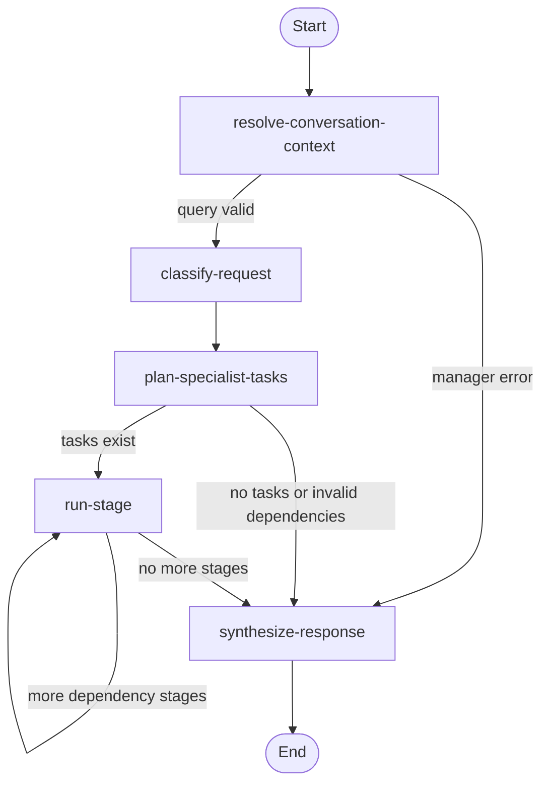

# AstroWeave Backend: Request-to-Response Walkthrough

This guide follows one request through the backend that exists in this repository. It is written for readers who may not already know FastAPI, LangGraph, or agent terminology. It intentionally does not document the Streamlit interface. The chart service is described only at the point where the main backend calls it.

## 1. The Short Version

The backend starts at the FastAPI application object `app` in [`src/astroweave/api/main.py`](../src/astroweave/api/main.py). A normal authenticated `POST /run` request is validated, associated with a user and conversation, and passed into a LangGraph workflow. That workflow asks an orchestrator LLM which registered specialist or specialists should answer. Specialists receive the question, recent conversation history, methodology, and chart data. Their findings are synthesized into the answer, then saved to SQLite before the API returns JSON.

There are two important alternatives:

- A configured `app_id` selects one specialist directly. This is the **fastpath**: it skips orchestrator classification, task planning, and final orchestrator synthesis, but still uses authentication, chart lookup, the specialist, and conversation persistence.
- A specialist can run in another process. The dispatcher sends it a signed-bearer-authenticated JSON `POST` request. This is an **A2A-style HTTP handoff** in the everyday sense of one agent service asking another to work. The code does not implement a formal A2A protocol or protocol-level discovery; it implements AstroWeave's own HTTP contract.

## 2. Terms Used Here

| Term | Meaning in this project |
| --- | --- |
| API / connector | The FastAPI application that receives requests, authenticates users, loads conversation history, and returns responses. |
| Orchestrator | The LangGraph workflow that classifies a question, selects specialists, arranges their tasks, and synthesizes their findings. |
| Specialist | A domain-focused agent: `career`, `finance`, `love`, or `sports`. |
| Graph state | The changing work record passed between graph nodes, such as the question, selected specialists, chart, findings, errors, and final answer. |
| Runtime context | Per-request metadata passed alongside graph state, such as authenticated user, conversation IDs, methodology, and birth details. |
| Fastpath | Direct execution of one server-authorized specialist using `app_id`, without running the orchestrator planner or synthesizer. |
| A2A-style handoff | A connector-to-specialist HTTP request. It is not a claim that this implementation follows a published A2A standard. |

## 3. Where the Backend Starts

The ASGI server imports `astroweave.api.main:app`, for example:

```sh
PYTHONPATH=src uvicorn astroweave.api.main:app --reload
```

`app` is the FastAPI application object. During module import, `main.py` also builds the compiled orchestrator graph and creates a `ConversationStore`. This means graph construction happens once when that Python process imports the module, rather than once for every HTTP request.

The `/run` route is the entry point for a question. Other API routes in the same file handle registration, sign-in, current-user lookup, health checks, and conversation history. A separately deployable specialist HTTP application is defined in [`src/astroweave/specialist_service.py`](../src/astroweave/specialist_service.py).

## 4. The Exact `/run` Request

The route accepts JSON and a bearer token. The token is in the HTTP header, not in the JSON body:

```http
POST /run
Authorization: Bearer <signed-user-token>
Content-Type: application/json
```

The Pydantic `RunRequest` model in `main.py` defines the JSON body:

| Field | Required? | Meaning and validation |
| --- | --- | --- |
| `query` | Yes | User's question; 1 to 10,000 characters. |
| `conversation_id` | No | Existing conversation to continue; 1 to 128 characters if supplied. Otherwise the connector creates or recovers one. |
| `session_id` | No | Current session within the conversation; 1 to 128 characters if supplied. Otherwise the connector creates or recovers one. |
| `username` | No | Optional consistency check. If supplied, it must equal the identity inside the bearer token. It does not establish identity by itself. |
| `app_id` | No | Optional server-side route selector. A configured value can select one specialist for the fastpath. |
| `message_id` | No | Idempotency key for this user message. Defaults to a generated UUID; 1 to 128 characters. |
| `methodology` | No | Defaults to `Let the system decide`; 1 to 64 characters. The normal orchestrator path normalizes recognized values. |
| `birth_details` | No | Optional nested object with `date`, `time`, `latitude`, `longitude`, `utc_offset_hours`, and optional `place_name`. Latitude and longitude are range-checked. |

Example minimal JSON body from the passing integration scenario:

```json
{
  "query": "How will my job affect my finances?",
  "message_id": "first-message"
}
```

The request body can contain `birth_details`, and FastAPI validates it if present. However, the current `/run` handler obtains chart birth details from the authenticated user's saved profile. It does not use `request.birth_details` to build the graph context. It also removes the profile's `date_known` field before sending birth details to the chart client. This distinction matters when reading requests or debugging missing chart data.

FastAPI validates the request model before the route body runs. A malformed body, missing `query`, or out-of-range coordinates in a supplied `birth_details` object result in a `422` response.

## 5. Request Lifecycle at a Glance

```mermaid
sequenceDiagram
    participant Client
    participant API as FastAPI /run
    participant Store as ConversationStore (SQLite)
    participant Graph as Orchestrator graph
    participant Dispatch as Dispatcher
    participant Specialist as Specialist graph/service
    participant Chart as Chart service
    participant LLM as Configured LLM provider

    Client->>API: POST /run + JSON + Bearer token
    API->>API: Validate body, verify token, load user profile
    API->>Store: Resolve IDs, fingerprint request, claim message_id
    alt Completed identical request
        Store-->>API: Saved answer
        API-->>Client: Replay response; graph is not run
    else New request
        API->>Store: Load bounded conversation/session history
        API->>Graph: Invoke with initial state + runtime context
        Graph->>LLM: Classify question and plan specialists
        loop For each dependency stage
            Graph->>Dispatch: Execute ready specialist(s)
            Dispatch->>Chart: Fetch chart once, then reuse it
            Dispatch->>Specialist: Invoke local graph or remote HTTP service
            Specialist->>LLM: Produce analysis/conclusion/confidence JSON
            Specialist-->>Graph: Specialist result or error
        end
        Graph->>LLM: Synthesize specialist findings as plain text
        Graph-->>API: Final graph state and answer
        API->>Store: Persist user + assistant turn and complete claim
        API-->>Client: Answer, IDs, state, empty execution_trace
    end
```

The diagram shows the ordinary route. The `app_id` fastpath skips the orchestrator graph and calls the dispatcher for one specialist instead; that path is detailed in section 10.

## 6. What the `/run` Handler Does First

The route implementation is `run()` in [`src/astroweave/api/main.py`](../src/astroweave/api/main.py). Before any LLM call, it performs these steps:

1. **Authenticate.** `authenticated_username()` reads the `Authorization` header, requires the `Bearer` scheme, and verifies the signed token. Missing, invalid, or expired tokens produce `401`.
2. **Check the optional body username.** If `username` is present and differs from the token identity, the route returns `403`.
3. **Load the saved profile.** The route looks up the authenticated user's SQLite profile. If it no longer exists, the route returns `401`.
4. **Resolve `app_id`.** If one was supplied, `_direct_specialist()` checks it against the server's `ASTROWEAVE_APP_ROUTES` JSON mapping and the specialist registry. An unknown or unauthorized app ID returns `403`; invalid JSON configuration returns `500`.
5. **Resolve conversation and session IDs.** Supplied IDs are used, or new UUIDs are generated. If this `message_id` has been seen before, its prior conversation/session IDs are recovered. Reusing the message ID with different IDs returns `409`.
6. **Create an idempotency fingerprint and claim.** The API hashes canonical JSON for the request after excluding `message_id` and `username`. The SQLite claim makes concurrent requests with the same message ID safe to detect. Reusing the same ID with different request data returns `409`; a still-running claim also returns `409`.

For a completed claim with the same fingerprint, the API returns the stored answer immediately. It does not load history, call the graph, or call an LLM again. The returned replay `state` contains `answer`, `history_persisted: true`, and `history_replayed: true`.

For new work, a claim token is held while the graph runs. The token is checked again when the turn is persisted, so an expired claim that has been taken over cannot complete over the newer request. If graph execution raises an exception, the claim is released and the route returns `502`.

## 7. State, Context, and Conversation History

The state contract is in [`src/astroweave/common/state/state.py`](../src/astroweave/common/state/state.py). It is a typed dictionary, not a database record. Fields are added as graph nodes do work. Important fields include:

- `user_query`, `messages`: current question and prior turns supplied to this run.
- `specialists`, `methodology`, `plan`, `task_dependencies`: planner decisions.
- `task_stages`, `pending_tasks`, `completed_tasks`, `current_task`: dependency planning and progress.
- `chart_data`, `dependency_results`, `specialist_results`: specialist inputs and outputs.
- `errors`, `iteration_count`, `answer`: failure/progress tracking and final response.
- `tool_results`, `stage_results`, `specialist_analysis`, `evaluation`, `is_sufficient`, and compatibility/history fields: additional state slots used by current or earlier graph behavior.

Several fields use LangGraph reducers. For example, `messages`, `specialist_results`, and `errors` append updates instead of replacing their existing lists. `stage_results` keeps only the latest five entries. A node generally returns a small dictionary of fields it changed; LangGraph merges that update into the running state.

Per-request metadata is separate, in [`src/astroweave/common/context/context.py`](../src/astroweave/common/context/context.py). It includes conversation/session IDs, username, methodology, and birth details. In the normal API path, the context is assembled from the authenticated profile and request IDs; the question itself goes in graph state.

Conversation history is loaded by the API before invoking the graph. [`src/astroweave/common/conversation/store.py`](../src/astroweave/common/conversation/store.py) stores conversations, sessions, messages, and idempotency claims in SQLite. By default, each run loads up to 12 messages from the current session and up to 8 messages from prior sessions in that conversation. These limits are configurable with `ASTROWEAVE_SESSION_HISTORY_LIMIT` and `ASTROWEAVE_CONVERSATION_HISTORY_LIMIT`. The graph's node named `resolve-conversation-context` does not query SQLite; it currently calls the manager to validate the query. The actual database load is in the API handler.

[`src/astroweave/common/communication/history.py`](../src/astroweave/common/communication/history.py) formats history as JSON and the prompts explicitly mark it as untrusted context, not instructions. History is made available to classification, specialist analysis, and final synthesis.

## 8. Normal Orchestration: The Main Graph

The graph is built in [`src/astroweave/graphs/orchestrator/orchestrator_graph.py`](../src/astroweave/graphs/orchestrator/orchestrator_graph.py). Its current sequence is:



### 8.1 `resolve-conversation-context`

This node calls `run_manager()` in [`src/astroweave/orchestration/manager/manager.py`](../src/astroweave/orchestration/manager/manager.py). Despite its name, it does not load conversation records. The API already supplied those. The manager trims the question and reports an error if it is empty; otherwise it preserves/initializes the iteration count.

### 8.2 `classify-request`

The classifier is the orchestrator's first LLM call. It creates a human message containing the user question, whether birth details are available, and formatted prior history. The system prompt is [`src/astroweave/graphs/orchestrator/prompts.py`](../src/astroweave/graphs/orchestrator/prompts.py).

It asks for JSON in this shape:

```json
{
  "specialists": ["career", "finance"],
  "tasks": [
    {"specialist": "career", "depends_on": []},
    {"specialist": "finance", "depends_on": ["career"]}
  ],
  "methodology": "vedic",
  "reasoning": "The question covers career and finances."
}
```

The exact values are LLM-selected; this is the contract, not a guaranteed answer. The classifier filters selected specialists against `SPECIALIST_REGISTRY`, so an LLM cannot add an arbitrary specialist name. A recognized methodology explicitly supplied by the caller wins; otherwise the classifier's methodology is used, and `vedic` is the fallback. [`src/astroweave/methodologies/__init__.py`](../src/astroweave/methodologies/__init__.py) maps labels such as `Let the system decide`, `Vedic`, `KP`, and `Both` to canonical values.

JSON output is parsed by [`src/astroweave/common/llm/parsing.py`](../src/astroweave/common/llm/parsing.py). The helper logs response length and finish reason, parses JSON, logs the `reasoning` or `analysis` field, and retries once if the response is malformed. A second malformed response becomes a graph error. This validates JSON syntax; it does not validate that every semantic field is perfect, so the graph also checks specialist names and dependencies.

### 8.3 `plan-specialist-tasks`

The task planner in `orchestrator_graph.py` removes duplicate specialist names and checks the dependency list. Every dependency must name a selected specialist; a specialist cannot depend on itself; a task cannot appear twice; and the resulting dependency graph must be acyclic. Invalid dependencies become errors instead of being executed.

It performs a topological sort, grouping specialists whose dependencies have already completed into a stage. Independent specialists are in the same stage and can run at the same time. A specialist with a dependency runs in a later stage, after the required specialist has returned a result.

### 8.4 `run-stage`

The stage runner calls `_get_chart_data()` and then `execute_specialist()` in [`src/astroweave/orchestration/dispatcher/dispatcher.py`](../src/astroweave/orchestration/dispatcher/dispatcher.py). If chart data is already in graph state, it is reused. Otherwise the chart is requested once and that response is shared by the stage's specialists and carried into later stages.

For each task, the dispatcher supplies only the findings from that task's declared dependencies as `dependency_results`. A task whose dependency did not produce a result is skipped and an error is recorded. Specialists in the same ready stage run concurrently using a `ThreadPoolExecutor` when there is more than one; a single task runs directly. The graph collects results and errors, marks the stage consumed, and moves to the next stage.

One specialist failure does not automatically abort all other specialists. Errors are accumulated in state. If the chart itself cannot be fetched, the stage stops with a chart error. If some specialists succeeded while others failed, the final answer is synthesized from available results; the full state still contains the accumulated errors.

### 8.5 `synthesize-response`

The synthesizer is the orchestrator's second LLM call when specialist results exist. It builds a compact text block from each result's specialist name, confidence, conclusion, and analysis. The synthesis prompt asks for one plain-text answer, not JSON.

If there are no specialist results, the node returns the joined error text, or a generic failure message if there are no errors. If the optional context-size guard is enabled and the synthesis input exceeds it, the node falls back to joining the specialist conclusions and records an error rather than failing the whole request.

## 9. What One Specialist Does

The shared specialist graph lives in [`src/astroweave/graphs/specialist/specialist_graph.py`](../src/astroweave/graphs/specialist/specialist_graph.py):

```text
planner -> executor -> collector -> evaluator -> synthesizer -> end
```

- `planner` currently does no work.
- `executor` looks up the `AgentDefinition` for `current_task` in [`src/astroweave/agents/specialists/__init__.py`](../src/astroweave/agents/specialists/__init__.py). It creates a prompt input from the question, methodology, untrusted prior history, dependency findings, and chart JSON. It asks that specialist's configured LLM for JSON.
- The expected specialist result has `analysis`, `conclusion`, and `confidence`. It is recorded in `specialist_results` with the specialist name.
- `collector` currently does no work.
- `evaluator` currently marks one pass sufficient. It does not ask the specialist to re-plan or loop.
- `synthesizer` currently does no work. The top-level orchestrator performs cross-specialist synthesis; on the direct fastpath the API uses the single specialist's conclusion itself.

The four registered domains are career, finance, love, and sports. Their prompts are kept in separate files under [`src/astroweave/agents/specialists/`](../src/astroweave/agents/specialists/) so a specialist's instructions can be changed independently.

The project has a typed tool interface and per-agent tool registries in [`src/astroweave/common/tools/`](../src/astroweave/common/tools/), but the current specialist registry assigns no tools and the specialist graph has no tool-calling loop. The chart client is called directly by the dispatcher; it is not currently selected by an LLM through that tool registry.

## 10. The Fastpath (`app_id`)

The fastpath starts in the same authenticated `/run` handler. The server configures an allowlist mapping, for example:

```sh
ASTROWEAVE_APP_ROUTES='{"career-app":"career"}'
```

Then a request body can include:

```json
{
  "query": "Career follow-up",
  "app_id": "career-app"
}
```

`_direct_specialist()` resolves `career-app` to the registered `career` specialist. The API still authenticates the user, loads their profile and conversation history, claims the message ID, and persists the result. Instead of invoking `_orchestrator_graph`, it invokes `execute_specialist()` once.

That means this route skips:

- Orchestrator LLM classification of the question.
- Multi-specialist task and dependency planning.
- Cross-specialist synthesis by the orchestrator.

It does **not** skip:

- Bearer-token authentication and user ownership checks.
- The chart lookup when chart data is not already available.
- Specialist prompt/LLM execution.
- Response persistence and idempotency handling.

The API builds the direct answer by joining returned specialist conclusions. If no conclusion exists, it joins returned errors. The direct route currently lowercases the request methodology but does not call the normal graph's `normalize_methodology()` helper, so clients should send a recognized value such as `vedic`, `kp`, or `both` when using this path.

The fastpath and remote execution are independent choices. If the selected specialist also has a URL in `ASTROWEAVE_SPECIALIST_URLS`, the fastpath's dispatcher call can be forwarded to that remote specialist service.

## 11. Remote Specialist / A2A-Style HTTP Handoff

By default, `execute_specialist()` invokes the shared specialist graph in the same Python process. A per-specialist URL can route execution to another process:

```sh
ASTROWEAVE_SPECIALIST_URLS='{"career":"http://127.0.0.1:8200"}'
```

The dispatcher posts to:

```text
POST <configured-base-url>/specialists/<name>/run
Authorization: Bearer <signed-user-token>
Content-Type: application/json
```

The JSON handoff is assembled in `execute_specialist()` and contains:

```json
{
  "user_query": "How will my job affect my finances?",
  "messages": [],
  "current_task": "career",
  "methodology": "vedic",
  "chart_data": {"...": "chart service response"},
  "dependency_results": []
}
```

In the actual request, `messages`, `chart_data`, and dependency findings contain real structures, not the shortened placeholders above. The connector sets a 90-second HTTP timeout, checks for an HTTP error, and reads the response as JSON. A remote failure is caught by the dispatcher and returned as a specialist error so the overall orchestration can handle it.

The receiving application is `app` in [`src/astroweave/specialist_service.py`](../src/astroweave/specialist_service.py). It verifies the bearer token, checks that the URL's specialist name is registered, validates the specialist request fields, and invokes the same specialist graph. The route path identifies the specialist; the service sets `current_task` from that path before invocation. The response is the specialist graph's state, including its `specialist_results` and/or `errors`.

Both processes must use the same `ASTROWEAVE_AUTH_SECRET`, otherwise the receiver cannot verify the connector's token. The code's token is an HMAC-SHA256 signed identity with a 12-hour expiry. In development, the security module falls back to a known development-only secret and logs a warning; production requires an explicit secret. Use HTTPS and a managed secret in a real deployment.

This HTTP exchange is the project's current agent-to-agent handoff. It is not the formal A2A protocol: there is no A2A agent card, discovery flow, task lifecycle protocol, or standard A2A message envelope implemented here. The application-specific endpoint and JSON schema are the contract.

## 12. Chart Service: Only the Boundary

The dispatcher calls [`src/astroweave/common/tools/chart_client.py`](../src/astroweave/common/tools/chart_client.py) only when a specialist needs chart data and the graph does not already contain it. It sends `POST /chart` to `ASTROWEAVE_CHART_SERVICE_URL` (default `http://127.0.0.1:8100`) with date, local time, latitude, longitude, UTC offset, optional place name, divisional-chart selection, and flags controlling dasha, bhava chart, and ashtakavarga sections.

The client returns the chart service's JSON as a Python dictionary. The response can include `d1`, `divisional_charts`, `dasha_bhukti`, `bhava_chart`, and `ashtakavarga`. The dispatcher passes this dictionary to specialists; AstroWeave's main backend does not import the chart library itself. Missing birth details or an HTTP failure becomes a graph error.

## 13. LLM Selection and JSON Handling

Call sites request models through `get_llm()` in [`src/astroweave/common/llm/factory.py`](../src/astroweave/common/llm/factory.py). `resolve_llm_config()` in `config.py` chooses provider/model/settings from environment variables. A specialist-specific override takes precedence over a role-level override, which takes precedence over the global value. Current defaults are Groq, `openai/gpt-oss-120b`, temperature `0.2`, and 4096 max tokens; the Groq builder applies the max-token setting.

The orchestrator role is used for classification and synthesis. The specialist role can be overridden for an individual specialist, such as `career`. Provider construction is registered in `providers.py`; the current built-ins are Groq, OpenAI, and Anthropic. The JSON-producing classifier and specialist calls use `invoke_json_response()` and get one retry for malformed JSON. The final synthesis call is plain text and is not parsed as JSON.

`ASTROWEAVE_CONTEXT_CHAR_LIMIT` optionally rejects oversized handoffs. If it is unset, blank, zero, or invalid, the guard is disabled. If set to a positive integer, the dispatcher checks the serialized specialist handoff, each specialist checks its LLM input, and the orchestrator checks its synthesis input.

## 14. Persistence, Authentication, and Common Errors

The account database code is [`app/auth.py`](../app/auth.py). Passwords are stored as salted scrypt hashes, not as plaintext. The API's bearer token is a signed identity with an expiry; in production, `ASTROWEAVE_AUTH_SECRET` must be configured. Conversation data and request claims are stored separately through `ConversationStore`, using the conversations database setting or, by default, the users database file.

When a new request completes, `persist_turn()` atomically writes the user message and assistant answer, updates conversation/session timestamps, and marks the idempotency claim complete. On an identical retry, the saved answer is returned. A message ID reused with different request content is a conflict. A pending request becomes reclaimable after the configured claim lifetime (default 30 minutes), using a new claim token to prevent an older worker from saving over the reclaimed work.

Useful status behavior in the current API:

| Status | Typical cause |
| --- | --- |
| `200` | Successful answer or successful replay of a completed request. |
| `401` | Missing/invalid bearer token, or authenticated account no longer exists. |
| `403` | Body username mismatch, unauthorized `app_id`, or conversation/message ownership failure. |
| `409` | Message ID reused with different content/IDs, or same request still in progress. |
| `422` | Invalid JSON body or failed `RunRequest` validation. |
| `502` | An uncaught exception while the API is running the graph. Many expected chart/LLM/specialist failures are instead stored in the graph's `errors` list. |

The `/run` response has five top-level keys: `answer`, `conversation_id`, `session_id`, `state`, and `execution_trace`. The last item is currently always an empty list; it is not a detailed graph trace. For successful non-replay requests, `state` is the final graph/direct-execution state plus `history_persisted`. Replay state is intentionally much smaller.

## 15. Real Executed Example

The example below was executed through the repository's own FastAPI integration scenario, [`tests/integration/test_api.py`](../tests/integration/test_api.py), specifically `test_connector_register_dag_persist_retry_and_direct_route`. It used the actual `/auth/register`, `/run`, graph, dispatcher, SQLite conversation store, and response-building code. To keep it deterministic and avoid external credentials, the test replaced the LLM responses and chart response with fixed test doubles. This was an end-to-end backend execution, but not a live commercial LLM call or a real chart calculation.

The test registered a temporary account with birth details for Chennai and a temporary SQLite conversation store. It then posted:

```json
{
  "query": "How will my job affect my finances?",
  "message_id": "first-message"
}
```

The configured test classifier returned two tasks: `career` with no dependency, followed by `finance` depending on `career`. The fake chart client returned `{"d1": {}}`; it was called once for both specialists. Each fake specialist LLM returned an `analysis`, an `Individual reading` conclusion, and `high` confidence. The fake synthesis LLM returned `Combined reading`.

The actual first response was HTTP `200`; a compact excerpt of the captured response was:

```json
{
  "answer": "Combined reading",
  "conversation_id": "<generated UUID>",
  "session_id": "<generated UUID>",
  "state": {
    "specialists": ["career", "finance"],
    "completed_tasks": ["career", "finance"],
    "task_stages": [],
    "specialist_results": [
      {"specialist": "career", "conclusion": "Individual reading", "confidence": "high"},
      {"specialist": "finance", "conclusion": "Individual reading", "confidence": "high"}
    ],
    "history_persisted": true
  },
  "execution_trace": []
}
```

The test then posted the same `message_id` and same body again. It received the saved `Combined reading`, with `history_replayed: true`; the orchestrator LLM call count did not increase. Finally, the test sent a new follow-up with `app_id: "career-app"` under a test server mapping to `career`. That returned `Individual reading` from one specialist, did not call the orchestrator LLM, and was persisted as the next turn.

The separate remote-specialist test, [`tests/unit/test_dispatcher.py`](../tests/unit/test_dispatcher.py), verifies that the dispatcher posts to `/specialists/finance/run`, includes a bearer token, and includes prior specialist findings in `dependency_results`.

The focused checks used for this walkthrough passed:

```sh
PYTHONPATH=src .venv/bin/python -m pytest -q \
  tests/integration/test_api.py::ApiTests::test_connector_register_dag_persist_retry_and_direct_route \
  tests/unit/test_dispatcher.py::DispatcherTests::test_remote_specialist_receives_dependency_findings
```

Result: `2 passed`. Pytest emitted one existing Starlette/AnyIO deprecation warning.

## 16. Other Backend Routes and Code Map

| Route or responsibility | Implementation |
| --- | --- |
| `GET /health` | `src/astroweave/api/main.py` |
| `POST /auth/register`, `POST /auth/sign-in`, `GET /auth/me` | `src/astroweave/api/main.py`; account storage/password hashing in `app/auth.py` |
| `POST /run` | `src/astroweave/api/main.py` |
| `GET /conversations`, `GET /conversations/{id}/messages`, `DELETE /conversations/{id}` | API routes in `src/astroweave/api/main.py`; SQLite implementation in `src/astroweave/common/conversation/store.py` |
| `POST /specialists/{specialist_name}/run` | `src/astroweave/specialist_service.py` |
| Orchestrator graph | `src/astroweave/graphs/orchestrator/orchestrator_graph.py` and its `prompts.py` |
| Specialist graph | `src/astroweave/graphs/specialist/specialist_graph.py` |
| Routing and remote/local specialist execution | `src/astroweave/orchestration/dispatcher/dispatcher.py` |
| Agent definitions and specialist prompts | `src/astroweave/agents/registry.py`, `src/astroweave/agents/specialists/` |
| Shared graph state and runtime context | `src/astroweave/common/state/state.py`, `src/astroweave/common/context/context.py` |
| LLM config, providers, and JSON parsing | `src/astroweave/common/llm/` |
| Chart HTTP client | `src/astroweave/common/tools/chart_client.py` |

## 17. What Is Not Yet Happening

These details prevent the current architecture from being mistaken for a more complete system than the code provides:

- The orchestrator and specialist LLMs choose/interpret work, but registered agent tools are currently empty and no LLM tool-calling loop runs.
- Specialist planner, collector, and synthesizer nodes are placeholders; specialist evaluation currently accepts the first executor result.
- The standard remote path is a custom authenticated HTTP request/response, not a formal A2A implementation.
- `execution_trace` is returned as an empty list; graph node logs are the current runtime trace.
- The `/run` handler uses birth details from the saved user profile, not the optional `birth_details` request field.
- Methodology is passed to prompts, but this code does not implement separate Vedic/KP retrieval or calculation logic; the chart service supplies chart data.
- The real execution example above uses mocked LLM and chart outputs. A true provider-backed run requires configured credentials and the relevant services to be reachable.