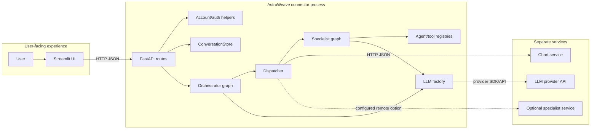
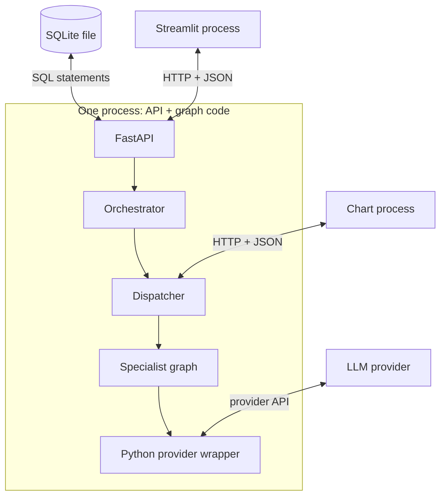

# 01. Orientation: The Project as a Set of Responsibilities

[Book home](../ASTROWEAVE_BOOK.md) | Next: [02. One Request, Step by Step](02-one-request.md)

## The question this chapter answers

When opening a repository with many folders, where is the user interface, where is the actual decision-making, and which component owns each job?

## 1. Think in boundaries, not buzzwords

AstroWeave is not one giant program with one magic “AI” function. It is a set of components with defined responsibilities. Some run in the same Python process; others are separate services reached over HTTP.



The dashed specialist route is optional. Without a matching `ASTROWEAVE_SPECIALIST_URLS` entry, the dispatcher invokes the specialist graph inside the main process. The chart service remains its own process.

## 2. A useful office analogy

Imagine a clinic that receives a question:

- **Streamlit is the reception desk screen.** It collects input and displays answers.
- **FastAPI is the front desk.** It verifies the request, checks identity, loads records, and returns a response.
- **SQLite is the filing room.** It stores user and conversation records.
- **The orchestrator is the coordinator.** It determines which specialist teams are relevant and in what order.
- **A specialist graph is a standard work procedure.** It assembles facts and asks its configured LLM for a domain analysis.
- **The LLM provider is an external consultant.** AstroWeave sends messages to it and receives a response.
- **The chart service is a calculation laboratory.** It receives birth inputs and returns computed chart data.

The analogy is only a map. In code, all of these are concrete Python functions, objects, HTTP calls, or external APIs. There is no independent human-like agent sitting inside the project.

## 3. Repository map

```text
AstroWeave/
|-- app/                         Streamlit UI, local auth helper, geocoding
|-- chart_service/               Separate FastAPI + PyJHora chart process
|-- docs/                        Engineering reference and this learning book
|-- src/astroweave/
|   |-- api/                     FastAPI connector routes
|   |-- agents/                  Agent definitions and specialist prompts/tools
|   |-- common/
|   |   |-- communication/       Formatting conversation messages
|   |   |-- config/              Logging setup
|   |   |-- context/             Runtime context type
|   |   |-- conversation/        SQLite transcript and request-claim store
|   |   |-- llm/                 Model config, provider factory, parsing, limits
|   |   |-- security/             Signed user tokens
|   |   |-- state/               Graph state types and reducers
|   |   `-- tools/               Tool contracts, wrappers, registries, chart client
|   |-- graphs/                  Orchestrator and specialist LangGraph workflows
|   |-- orchestration/           Manager and specialist dispatcher
|   `-- methodologies/           Methodology normalization and future space
`-- tests/                       Unit and integration behavior checks
```

### What the main folders mean

- `app/` is the interface and account-facing side. `streamlit_app.py` builds the UI; `auth.py` owns SQLite user/password operations; `geocoding.py` turns a place name into coordinates.
- `chart_service/` is deliberately separated from the main app. Its dependencies include PyJHora; the main app communicates with it over HTTP rather than importing its calculation package.
- `src/astroweave/api/` is the HTTP boundary. It validates request bodies, authenticates, loads conversation context, runs the graph, persists the answer, and serializes a response.
- `src/astroweave/graphs/` contains workflows: named node functions connected through LangGraph.
- `src/astroweave/orchestration/` contains non-graph helper logic used by graph nodes, especially dispatching a specialist task.
- `src/astroweave/agents/` describes specialist identities and prompts. A registry is a catalog; it is not itself a running agent.
- `src/astroweave/common/` contains shared contracts and infrastructure used by several parts of the application.
- `tests/` checks local contracts and component behavior, commonly replacing external services and LLMs with test doubles.

## 4. Process boundaries

A **process** is a running program with its own memory. A function call inside a process is different from an HTTP request to another process.

| Component | Default location | How another component reaches it |
|---|---|---|
| Streamlit | Port 8501 | Browser/user interaction; HTTP request to connector |
| Main FastAPI connector | Port 8000 | HTTP routes such as `/run` |
| Chart service | Port 8100 | Dispatcher client POSTs to `/chart` |
| Optional specialist service | Configured, e.g. port 8200 | Dispatcher POSTs to `/specialists/{name}/run` |
| LLM provider | External/provider-specific | LangChain provider integration and network API |
| SQLite | Local file | Python `sqlite3` connections |



The chart calculation is remote from the connector process even if both run on one laptop. “Remote” here means a different server process reached through HTTP, not necessarily a different physical machine.

## 5. The names `agent`, `specialist`, and `graph`

- **Specialist name:** a string like `"career"` used to choose a registered domain.
- **AgentDefinition:** a Python dataclass containing the name, description, prompt, and tool registry for a specialist.
- **Specialist graph:** a LangGraph workflow implementation shared by career, finance, love, and sports.
- **LLM call:** a request to a model provider. A specialist name/configuration can choose a prompt or provider settings, but it does not imply a separate process.

This design reuses one specialist graph for several agent definitions. The current graph looks up the requested `AgentDefinition`, takes its prompt, and calls the configured LLM. The tool registry is not used in that executor yet. See [06. Tools and Handoffs](../BEGINNER_GUIDE.md) for why that matters.

## 6. The most important boundaries

1. **UI to API:** JSON over HTTP. The API cannot assume that request-body values are authenticated identity.
2. **API to graph:** Python method call with a state dictionary and runtime context.
3. **Graph to LLM:** Python model invocation with structured messages; response comes back as model data.
4. **Dispatcher to chart service:** JSON over HTTP. A network call crosses a process boundary.
5. **API to SQLite:** SQL statements and transactions.
6. **Optional dispatcher to remote specialist:** authenticated HTTP request instead of a local graph invocation.

At each boundary ask: What data is passed? What trusts it? What can fail? What comes back?

## 7. What this architecture does not imply

- The LLM does not see every Python object in memory.
- The agent registry does not automatically attach tools to an LLM.
- A graph node named `planner` is not necessarily an LLM planner.
- The chart service does not automatically know the user; it receives chart inputs.
- A health endpoint only says that its process can answer that endpoint. It does not prove every downstream dependency works.

## Continue

Go to [02. One Request, Step by Step](02-one-request.md) and trace one concrete question through the system. For the complete component contract tables, see [PROJECT_DOCUMENTATION.md](../PROJECT_DOCUMENTATION.md).
