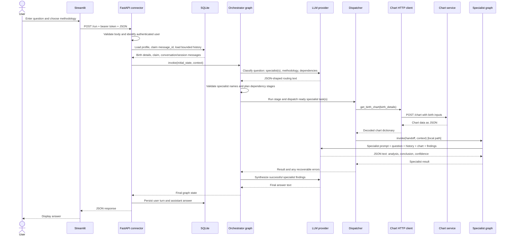
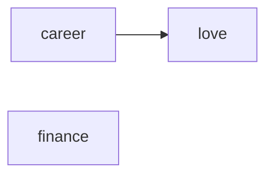
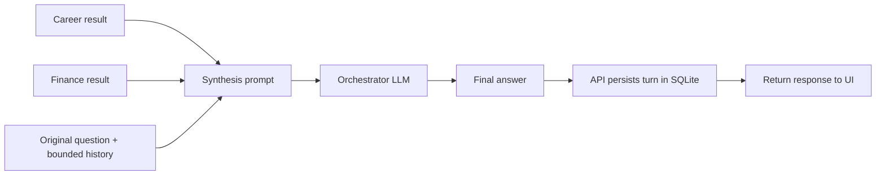

# 02. One Request, Step by Step

[Book home](../ASTROWEAVE_BOOK.md) | Previous: [01. Orientation](01-orientation.md) | Next: [03. Python Foundations](03-python-foundations.md)

## The question this chapter answers

A user types “Will I get promoted this year?” and presses Submit. Which code runs, what information crosses each boundary, and where does the final answer come from?

## 1. The route map



The diagram is a default local specialist path. A specialist can instead be configured as a separate HTTP service; that one arrow changes, described in section 8.

## 2. The request has two envelopes

The API receives a **request body** and an **Authorization header**.

Example request body (abridged):

```json
{
  "query": "Will I get promoted this year?",
  "message_id": "a-unique-request-id",
  "conversation_id": "a-conversation-id",
  "session_id": "a-session-id",
  "methodology": "Let the system decide"
}
```

The bearer token arrives in a header, not as proof supplied by the user in the JSON body:

```http
Authorization: Bearer <signed-token>
```

`RunRequest` in `src/astroweave/api/main.py` is a Pydantic model. Its fields specify required/optional values and constraints, such as a non-empty query with a maximum length. FastAPI uses this model to parse and validate JSON before `run(...)` handles it. Invalid request shapes normally produce an HTTP 422 response.

The user's birth details are loaded from the authenticated account record, rather than trusting a second copy from the request body. The signed-in identity is derived from the verified token. This is a key design distinction: **request data says what to do; the verified token says who is asking.**

## 3. At the connector: authenticate, claim, load

`run(...)` in `src/astroweave/api/main.py` proceeds roughly like this:

1. FastAPI resolves `authenticated_username` from the bearer token dependency.
2. The handler rejects a body username that disagrees with the authenticated username.
3. It loads the account profile and birth details.
4. It resolves an optional direct-specialist `app_id` route.
5. It finds or creates conversation and session UUIDs.
6. It fingerprints the request fields and claims the `message_id` in SQLite.
7. It returns the already-persisted answer for an exact replay instead of repeating model calls.
8. It loads a bounded window of conversation history.
9. It creates graph state and runtime context, then runs either the orchestrator or configured direct specialist.
10. It persists the user message and final answer, then returns JSON.

### Why claim a message before doing expensive work?

LLM and chart calls take time. The durable request claim prevents two copies of the same message from doing the same work at once. The store can tell these cases apart:

| Situation | Result |
|---|---|
| Same `message_id`, same request, already complete | Return the saved answer (idempotent replay). |
| Same ID and content, another process is handling it | Return a conflict indicating work is in progress. |
| Same ID but different request data | Return a conflict; one ID cannot mean two different requests. |
| New ID | Claim and start work. |

This is not the same as caching every possible answer. The ID identifies a particular submitted message, and a fingerprint ties that ID to the request contents.

## 4. State and context enter the graph

The API creates two related objects:

```python
initial_state = {
    "user_query": request.query,
    "messages": conversation_history + session_history,
}
context = {
    "conversation_id": conversation_id,
    "session_id": session_id,
    "username": authenticated_user,
    "methodology": request.methodology,
    "birth_details": profile_birth_details,
}
```

This is a teaching example based on the real fields; production code filters `date_known` from chart inputs.

- **State** is the evolving work record. The graph adds selected specialists, chart data, findings, errors, and answer.
- **Context** is request-scoped supporting information. It includes identity and birth details needed by downstream nodes.

The API starts the graph with `_orchestrator_graph.invoke(initial_state, context=context)`. The first `.invoke` here starts a LangGraph workflow. It does not directly call the LLM and it does not execute an item from `ToolRegistry`.

## 5. The orchestrator classifies and validates

The graph's `classify-request` node builds a pair of messages for the routing LLM:

- A **system message** contains the routing instructions and expected response shape.
- A **human message** contains the user question, bounded history, and whether birth details are available.

The model may suggest specialist names, but the code filters them through `SPECIALIST_REGISTRY`. If the LLM invents or misspells a specialist, that value is discarded. This is an allow-list: model output does not grant permission to run arbitrary code.

The same node chooses methodology using this order:

1. Valid methodology forced by the user/request context.
2. Methodology returned by the classifier.
3. Default `vedic`.

The exact routing prompt is in `src/astroweave/graphs/orchestrator/prompts.py`. The code doing the filtering is in `orchestrator_graph.py`.

## 6. Planning dependencies: why there can be stages

Suppose the LLM returns three specialists: `career`, `finance`, and `love`, with `love` depending on `career`.



A valid execution schedule is:

```text
Stage 1: career + finance (independent, may run concurrently)
Stage 2: love (waits for career's result)
Then: synthesize
```

The planner validates specialist names, dependency references, duplicates, and cycles. If it detects a cycle such as career waiting on finance while finance waits on career, it stops before dispatching work.

The `run-stage` node shares the chart data and gives a dependent specialist only the findings it declared as dependencies. Independent work in a stage may use `ThreadPoolExecutor`. This is concurrency in Python: multiple task calls are allowed to make progress at once. It is not the same as the LLM calling a tool.

## 7. Chart retrieval and specialist handoff

Before the first specialist needs a chart, the dispatcher calls the chart HTTP client. The returned chart is placed in shared graph state and reused for later work in the same run.

For local specialist execution, dispatcher code builds a smaller handoff object:

```text
user_query          What the person asked
messages            Bounded prior conversation
current_task        Which registered specialist to run
methodology         Requested analysis method
chart_data          Calculated chart facts
 dependency_results Findings from required predecessor(s)
```

Then it calls the compiled specialist graph's `.invoke(handoff, context=runtime.context)`. The exact local/remote distinction and why this is not a model-tool call are covered in [06. Tools and Handoffs](../BEGINNER_GUIDE.md).

## 8. The specialist produces a result

The shared specialist graph:

1. Reads the specialist name from `current_task`.
2. Looks up its `AgentDefinition` in `SPECIALIST_REGISTRY`.
3. Uses that definition's prompt.
4. Builds model input containing question, methodology, history, dependency findings, and chart JSON.
5. Calls the specialist's configured model.
6. Parses JSON and records `analysis`, `conclusion`, and `confidence`.

The response contract is currently a **prompt-level expectation** plus JSON syntax parsing, not a strict Pydantic schema that guarantees every field or confidence value. Missing values have defaults in Python. If JSON is malformed, the shared helper retries once.

A specialist's conclusion is not automatically the user-visible answer. The orchestrator collects results and calls a separate synthesis step.

## 9. Synthesis and persistence

When stages are finished, the orchestrator synthesizer sends the original question and successful specialist findings to the orchestrator LLM. If there are no successful findings, the graph returns an error-based answer. If a context-size guard rejects synthesis, the code falls back to joining specialist conclusions.

The API receives the final graph state and persists exactly the user question and assistant answer as the transcript turn. It then returns a response with `answer`, IDs, `state`, and currently an empty `execution_trace` list.



## 10. Direct-specialist route

The connector may map an `app_id` to a specialist via `ASTROWEAVE_APP_ROUTES`. In that case, it calls `execute_specialist(...)` directly instead of running request classification, dependency planning, or orchestrator synthesis. It still authenticates, retrieves account details/history, and persists the resulting conclusion.

This is a server-controlled route, not an app ID chosen by the LLM. An unknown or unauthorized app ID is rejected.

## 11. Where to put a breakpoint or log

| Question | First place to inspect |
|---|---|
| Did the API receive this request? | `api/main.py`, inside `run(...)` |
| Which user owns the request? | `authenticated_username` and `verify_user_token(...)` |
| Did a replay short-circuit model work? | `claim_request(...)` result and `persisted_answer` check |
| Which specialists were selected? | `_classify_request(...)` log and returned `specialists` |
| How are dependencies scheduled? | `_plan_specialist_tasks(...)` and `task_stages` |
| Did chart service respond? | `_get_chart_data(...)`, then `chart_client.get_birth_chart(...)` |
| What exactly went to a specialist? | `execute_specialist(...)`'s `handoff` dict |
| What reached the LLM? | Specialist `_executor(...)`'s `user_content` and messages |
| Where is final answer made? | `_synthesize_response(...)` or direct-specialist branch |
| Was the turn durably saved? | `persist_turn(...)` and `history_persisted` |

## 12. Common misconceptions

- **“The classifier answered the astrology question.”** It routes the question. The specialist analyzes; the synthesizer combines results.
- **“The chart client is an LLM tool.”** It is called directly by dispatcher Python code.
- **“The request body is the user's identity.”** Identity comes from the verified bearer token.
- **“Every specialist runs at once.”** Only tasks in the same dependency stage can run concurrently.
- **“A returned graph state is the database transcript.”** Graph state is in-memory run data. Only the turn persistence code writes the user/assistant messages to SQLite.
- **“The model can select any name it returns.”** Specialist names are checked against a registry before execution.

## Continue

Read [03. Python Foundations](03-python-foundations.md) for the syntax used in these steps, or jump to [04. Graphs and Shared Data](04-graphs-and-state.md) to understand state updates and conditional routing.
