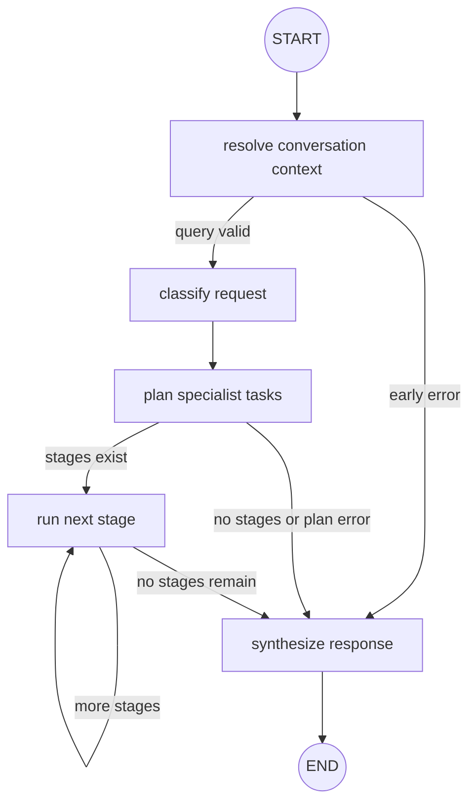
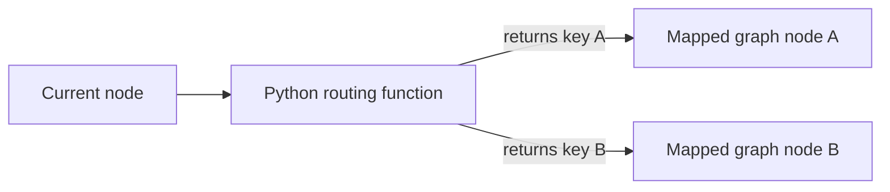
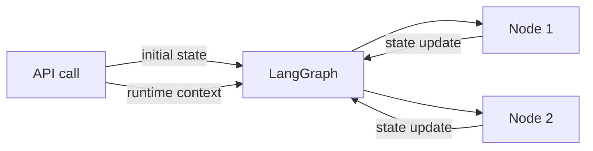
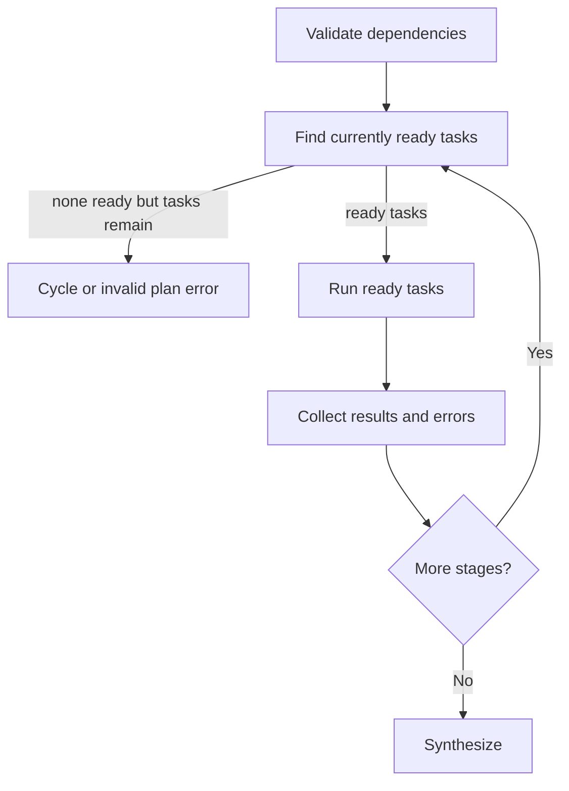
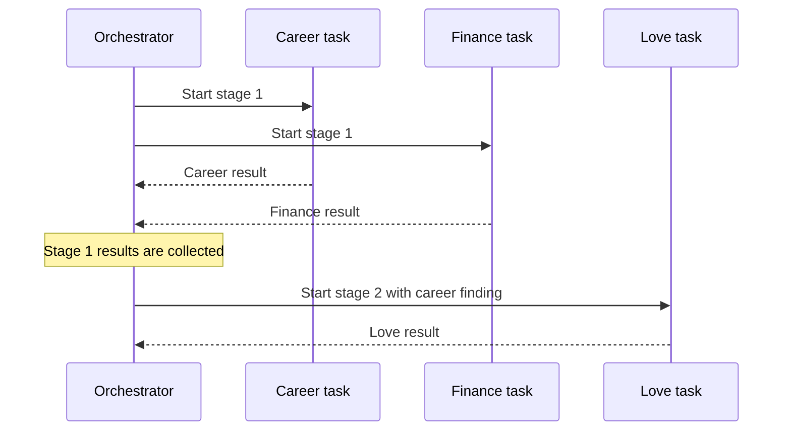
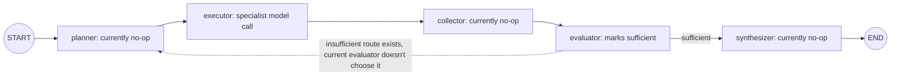

# 04. Graphs and Shared Data: How LangGraph Moves the Work

[Book home](../ASTROWEAVE_BOOK.md) | Previous: [03. Python Foundations](03-python-foundations.md) | Next: [05. LLM Calls and Prompts](05-llms-and-prompts.md)

## The question this chapter answers

What is a graph in LangGraph, how does a Python node run, how does data move between nodes, and how do stages/dependencies affect the order?

## 1. Workflow graph without the jargon

A workflow graph is a map of steps and allowed transitions. The steps are ordinary Python callables that the graph runtime invokes. The edges say what should happen next.



The graph is built in `build_orchestrator_graph()` in `src/astroweave/graphs/orchestrator/orchestrator_graph.py`. That function:

1. Creates a `StateGraph` with the project state type and context schema.
2. Registers named node functions such as `_classify_request` and `_run_stage`.
3. Adds fixed edges for unconditional transitions.
4. Adds conditional routes that inspect state and choose a destination.
5. Calls `.compile()` and returns the runnable graph.

**Building/compiling** describes the workflow. **Invoking** the compiled graph runs it for an input. They are separate moments.

## 2. A node is a Python function

A graph node named `classify-request` is registered like this:

```python
graph.add_node("classify-request", _classify_request)
```

The string is the graph's node name. `_classify_request` is the actual Python function the graph executes when it reaches that node. Naming a node `planner` does not make the function an AI planner; inspect its body to see whether it routes, calls an LLM, or returns an empty update.

Nodes commonly have a shape like:

```python
def _some_node(state: State) -> State:
    # read the current state
    # do one responsibility
    return {"some_field": "new value"}
```

Some nodes also accept `runtime: Runtime[Context]`. The graph supplies runtime information in addition to state. The exact type hints describe the intended API; the graph's registration and invocation are what put the function into the workflow.

## 3. Edges and conditional routes

A fixed edge says one node always follows another:

```python
graph.add_edge("classify-request", "plan-specialist-tasks")
```

A conditional edge says a router function chooses among named destinations:

```python
graph.add_conditional_edges("plan-specialist-tasks", _route_stage, {
    "run-stage": "run-stage",
    "synthesize-response": "synthesize-response",
})
```

`_route_stage(state)` returns a key such as `"run-stage"`. The mapping turns that key into a graph destination. The router usually does not perform the destination's work; it selects where to go next.



## 4. State: the shared working record

`State` in `src/astroweave/common/state/state.py` is a `TypedDict`. It describes keys and intended value types for the graph's working dictionary:

```python
class State(TypedDict, total=False):
    user_query: str
    specialists: list[str]
    chart_data: dict[str, Any]
    specialist_results: Annotated[list[SpecialistResult], operator.add]
    errors: Annotated[list[str], operator.add]
```

`total=False` means state dictionaries may omit fields. They are filled as the graph proceeds. This is important because the initial state only contains the question and messages; it does not already contain an answer, chart, or specialist results.

Think of state as a shared work folder passed from one step to the next. A node typically returns only its changes. The graph combines those changes with the existing data.

## 5. Reducers: what does “combine this update” mean?

Some fields have an `Annotated` reducer. For example:

```python
specialist_results: Annotated[list[SpecialistResult], operator.add]
```

The reducer is the merge rule. `operator.add` on lists concatenates them. If one task returns a new specialist result, the graph can append it rather than erase earlier results. `errors` works similarly.

```text
Existing specialist_results: [career_result]
Node update:                  [finance_result]
Reducer:                      list addition
Merged value:                 [career_result, finance_result]
```

Other fields use the default update behavior and are replaced by a new value. A custom reducer, `keep_latest_five`, combines stage outputs and keeps only the latest five.

A reducer is not a function call chosen by the LLM. It is graph data-merge behavior configured by Python.

## 6. Context: the request envelope beside state

`Context` is defined separately in `src/astroweave/common/context/context.py`. It includes fields such as:

- `username`
- `conversation_id`
- `session_id`
- `methodology`
- `birth_details`

The API passes it when it invokes the graph. A node that accepts `runtime` can access `runtime.context`. Context is intended for request-scoped supporting information, while state tracks evolving workflow results.



This distinction helps avoid stuffing every value into every prompt. It does not itself guarantee secrecy: anything a node adds to an LLM message can be sent to the provider.

## 7. The orchestrator's dependency planner

The LLM may return a list of specialists and dependency descriptions. The Python planner then validates those values and computes stages. It does not just trust the LLM's graph.

For example:

```text
career:  no dependencies
finance: no dependencies
love:    depends on career
```

The planner calculates:

```text
Stage 1 = [career, finance]
Stage 2 = [love]
```

It rejects invalid specialist names, missing/self dependencies, duplicate dependency entries, and cycles. A topological stage is a set of tasks whose dependencies have already been completed.

The stage execution path is:



## 8. Concurrency within a stage

Tasks in one stage do not depend on each other's results, so the orchestrator can run them in a `ThreadPoolExecutor`. After all calls complete, it collects updates. A later dependency stage waits until this collection is done.



A failed independent task is recorded as an error; other tasks can still succeed. A dependent task is skipped if a required predecessor did not produce a result.

“Parallel” here refers to application tasks in a stage. It does not mean one LLM response creates concurrent function calls. The execution structure is written in Python.

## 9. The specialist subgraph



The live specialist graph performs one LLM analysis pass. `invoke_json_response` may retry malformed JSON once; that retry is inside the response helper, not a graph re-planning loop. The evaluator currently returns `is_sufficient=True`, so the graph does not loop back to the planner.

The names `planner`, `collector`, and `synthesizer` indicate future/structural slots but their current functions return no work. Read implementations, not just diagram labels.

## 10. `.invoke()` depends on its receiver

The project uses the same method name for several objects:

```text
compiled_graph.invoke(state, context=...)  -> run graph nodes
llm.invoke(messages)                       -> ask a chat model
function_tool.invoke(**arguments)           -> call wrapped Python function
```

The method name is not enough to know what happens. Ask what object appears before the dot. This is the most useful trick when reading framework-heavy code.

## 11. Why `tool_results` exists in State

`tool_results` is a typed state field with an additive reducer. It is reserved for a possible future tool workflow. No current specialist node writes tool results or routes based on them. A state schema can describe planned capacity without activating it.

The same principle applies to `needs_replanning`, methodology packages, and no-op graph nodes: inspect current call sites before concluding they are active.

## 12. Graph invocation as a black-box contract

When application code calls:

```python
result = graph.invoke(initial_state, context=context)
```

it expects the graph runtime to:

1. Start at the graph's `START` node.
2. Call node functions in edge-selected order.
3. Pass the current state/context to compatible nodes.
4. Apply each node's update and reducer rules.
5. Follow conditional routes.
6. Stop at `END` and return the final state.

The caller does not need to manually call every node in sequence. However, the graph cannot invent business behavior: that behavior must exist in the Python functions registered as nodes.

## 13. Graph tests: what they prove

`tests/unit/test_orchestrator_graph.py` uses mock LLMs and mocked dispatcher functions to verify behavior such as:

- A dependent task waits until the earlier task result exists.
- Cyclic plans are rejected before specialist dispatch.
- Multiple tasks complete before synthesis.
- A specialist failure does not prevent an independent specialist from running.
- Empty questions short-circuit before an LLM call.

These tests prove the graph logic under controlled inputs. They do not verify a live provider API, real chart calculations, or the correctness of astrological interpretation.

## Continue

Next read [05. LLM Calls and Prompts](05-llms-and-prompts.md). For tools as graph capabilities versus model-directed functions, continue to [06. Tools and Handoffs](../BEGINNER_GUIDE.md).
