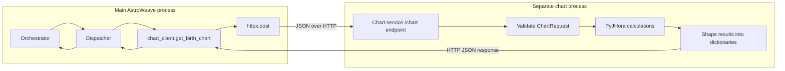
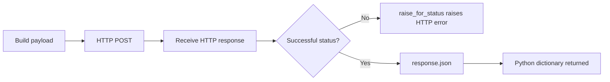
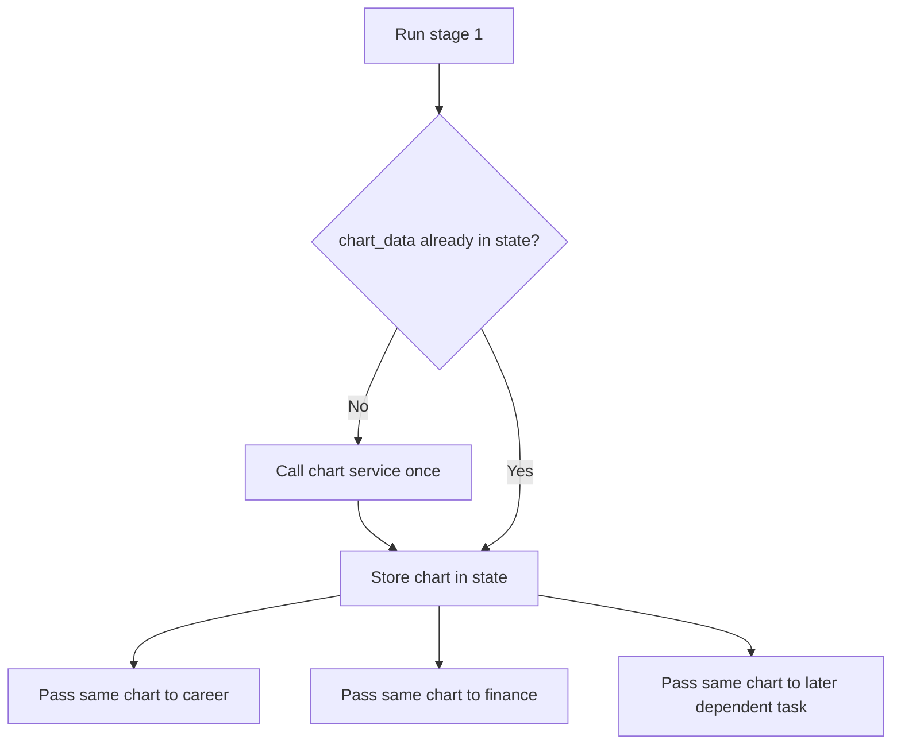

# 07. Chart Service and HTTP: A Separate Calculation Process

[Book home](../ASTROWEAVE_BOOK.md) | Previous: [06. Tools and Handoffs](../BEGINNER_GUIDE.md) | Next: [08. Accounts and History](08-accounts-and-history.md)

## The question this chapter answers

Who calculates the chart, how does the request reach that code, what comes back, and why is this not the same thing as an LLM tool call?

## 1. Two services, two jobs



The dispatcher already decided that chart data is needed. It calls a Python HTTP client. The chart service doesn't get invoked because an LLM asked for it; it gets invoked because the dispatcher code calls `get_birth_chart(...)`.

## 2. Why keep this in another process?

The chart service wraps PyJHora and its dependency/license boundary. The main application does not import PyJHora. Instead, it depends on a small HTTP contract: send the birth inputs to `/chart`, receive a JSON object.

This creates a separation of deployment and dependencies. It is not a security wall by itself, and it is not legal advice. It does make the integration point explicit: the main service only needs the HTTP client contract.

## 3. The request payload

`get_birth_chart(...)` in `src/astroweave/common/tools/chart_client.py` receives ordinary Python arguments such as:

- `date` as a string like `1990-01-01`
- `time` as a local time string like `10:00:00`
- latitude and longitude
- UTC offset in hours
- optional place name
- optional divisional-chart factors and include flags

It creates a Python dictionary and sends it as JSON:

```python
response = httpx.post(
    f"{CHART_SERVICE_URL.rstrip('/')}/chart",
    json=payload,
    timeout=timeout,
)
```

`CHART_SERVICE_URL` comes from `ASTROWEAVE_CHART_SERVICE_URL`; its default is `http://127.0.0.1:8100`. `.rstrip('/')` prevents a doubled slash when joining the configured base URL with `/chart`.

The `json=payload` argument asks HTTPX to serialize the dictionary to JSON and set the appropriate request body. `timeout` bounds how long the client waits for a response.

## 4. What the client does with the response



- `raise_for_status()` turns a non-success HTTP status into an exception.
- `response.json()` decodes a JSON response body into Python values.
- The function returns the decoded dictionary to the dispatcher.

So the Python client function runs in the main process. The actual calculations run in the chart process. HTTP is the messenger between them.

## 5. What happens in `/chart`

The `compute_chart(request)` route in `chart_service/main.py`:

1. FastAPI validates the request against `ChartRequest`.
2. The function splits date and time strings into integer components.
3. It builds a PyJHora `Place` from the place label, coordinates, and timezone offset.
4. It converts the local date/time to the library's Julian-day representation.
5. It computes the D1/Rasi positions and KP-lord data.
6. It computes requested divisional charts.
7. It conditionally adds dasha/bhukti, bhava, ashtakavarga, shadbala, yoga, transit, and current-dasha sections.
8. It returns a dictionary. FastAPI serializes that dictionary as JSON for the HTTP response.

The service also exposes `/health`. That checks process responsiveness; it does not calculate a chart or validate all input combinations.

## 6. Chart result shape

The response is a nested JSON object. A simplified example:

```json
{
  "d1": {
    "ascendant": {"sign": "Aries", "longitude_in_sign": 2.1},
    "planets": [{"planet": "Sun", "sign": "Taurus", "longitude_in_sign": 15.2}]
  },
  "divisional_charts": {"D9": {"ascendant": {}, "planets": []}},
  "dasha_bhukti": [],
  "bhava_chart": [],
  "ashtakavarga": {},
  "shadbala": {},
  "yogas": [],
  "transits": {},
  "current_dasha": {}
}
```

This example is abridged; exact output depends on request flags and PyJHora output. Python dictionaries/lists become JSON objects/arrays when crossing the HTTP boundary, then become dictionaries/lists again when decoded by `response.json()`.

The chart is deterministic application data, unlike LLM-generated language. The chart service computes positions/tables; the LLM later interprets the supplied data according to its prompt. A calculated chart is not itself an astrological conclusion.

## 7. Reuse across multiple specialists

The orchestrator's stage runner calls `_get_chart_data(...)`. On the first successful request it saves the returned chart in state. Later task stages reuse that value rather than requesting the same chart again during the same reading.



The chart is also passed in the specialist handoff to a local or remote specialist. It is not recalculated independently by each LLM.

## 8. Failures and where they are translated

| Failure | Likely boundary/handling |
|---|---|
| Missing birth details | Dispatcher returns a readable state error before HTTP. |
| Invalid input fields | FastAPI/Pydantic may return HTTP 422. |
| Malformed date/time pieces | Chart route maps integer parsing failure to HTTP 422. |
| Chart calculation exception | May surface as a server-side error; not all library errors are translated. |
| Network failure/time-out | HTTPX raises; dispatcher catches HTTP errors and adds an error to graph state. |
| Non-success HTTP response | `raise_for_status()` raises; handled at dispatcher boundary when an HTTP error. |
| Valid HTTP but invalid JSON | Response decoding raises; outer dispatcher error handling captures the failed task. |

A failure in chart retrieval means a specialist cannot receive the expected chart. The orchestrator records that error and produces an error-based answer if there are no successful findings.

## 9. How to test this boundary

A unit test for the dispatcher can mock `get_birth_chart` and assert that birth details are passed correctly. A client test can mock HTTPX and assert the URL, JSON payload, timeout, and handling of status errors. An integration test can run both processes and calculate a real chart.

These tests answer different questions:

- Mocked unit test: Did our Python code construct and route the request correctly?
- Service/API test: Does the endpoint validate and shape a response?
- Real end-to-end test: Can the local client reach the service with installed dependencies and valid data?

A green mocked test does not prove the chart service is running on the machine.

## 10. What is a “tool” here?

In broad architecture discussions, a service that provides a capability may be called a tool. But when tracing execution precisely, the chart route is a Python call chain:

```text
dispatcher -> get_birth_chart() -> httpx.post() -> chart service endpoint
```

The model is not asked whether it wants a chart, and the chart client is not included in the specialist's LLM tool schema. The application requires a chart before starting specialist analysis. This contrasts with a future model-directed function tool, where the model would return a structured request and Python would validate and execute it. See [06. Tools and Handoffs](../BEGINNER_GUIDE.md).

## Continue

Next read [08. Accounts, Security, and Memory](08-accounts-and-history.md) to follow identity and conversation data. For the full chart API contract, see [PROJECT_DOCUMENTATION.md, Chart Service](../PROJECT_DOCUMENTATION.md).
