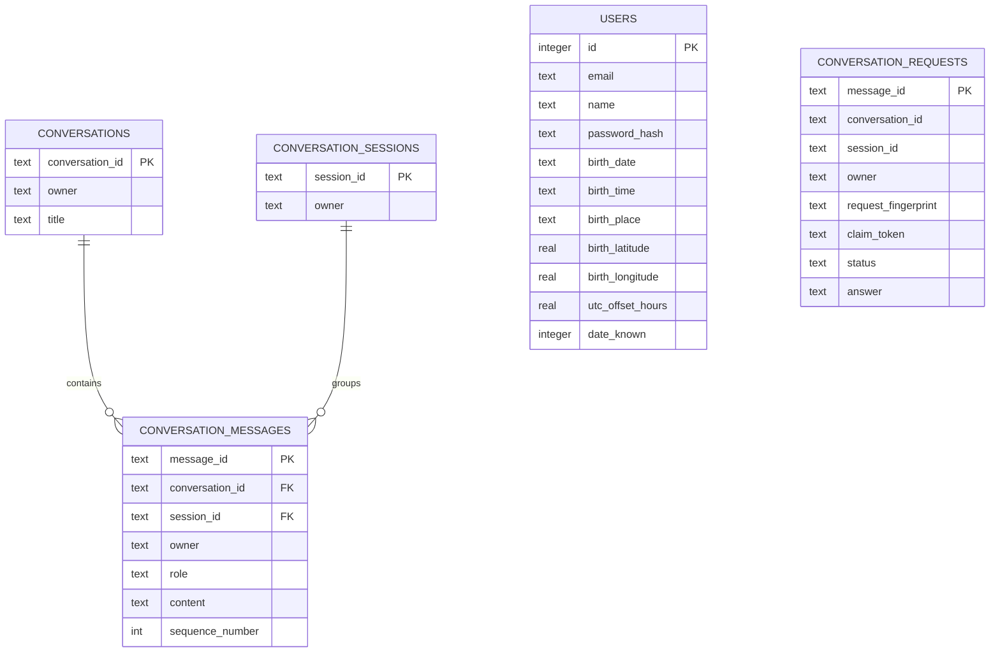
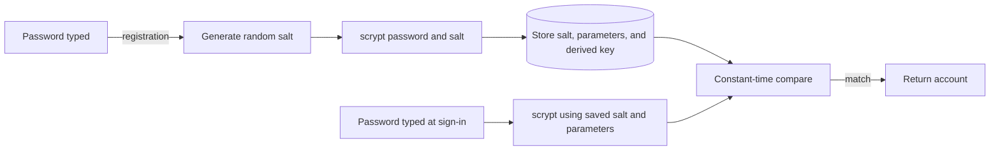
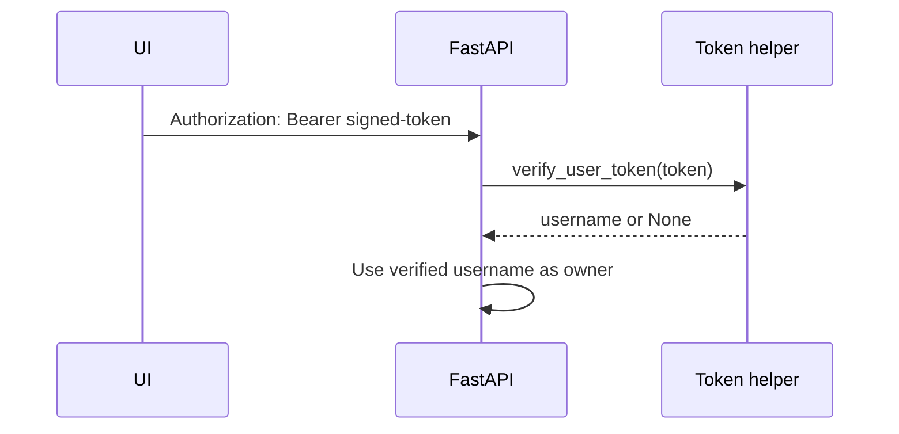
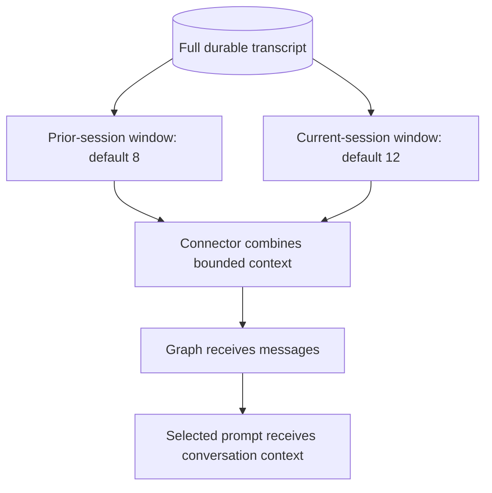
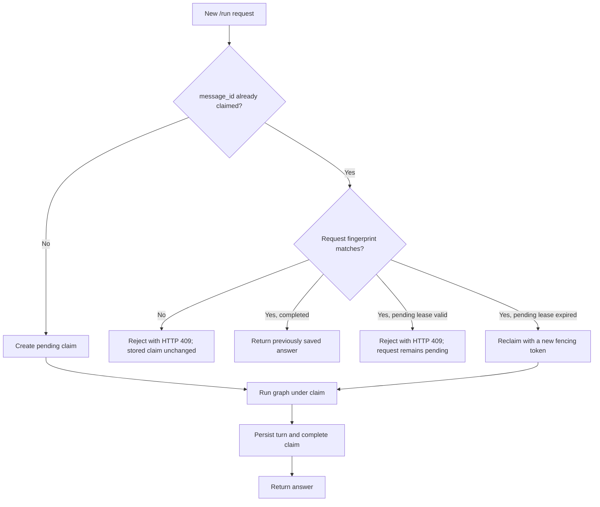

# 08. Accounts, Security, and Memory

[Book home](../ASTROWEAVE_BOOK.md) | Previous: [07. Chart Service](07-chart-service.md) | Next: [09. Tests and Operations](09-testing-and-operations.md)

## The question this chapter answers

How does AstroWeave know who submitted a request, where are account details stored, how does a conversation continue across turns, and what does the word “memory” mean here?

## 1. Two SQLite responsibilities

AstroWeave uses SQLite, a database stored in a local file. User accounts and conversations share the configured database path by default, but their code responsibilities are separated:

Only the two message-to-conversation/session relationships shown are declared SQLite foreign keys. User ownership and request-to-conversation/session associations are enforced by application code using the stored IDs and owner values, not by declared SQL foreign keys. The exact schemas are initialized in `app/auth.py` and `common/conversation/store.py`.

- **Account store (`app/auth.py`):** registration, password hashing/checks, birth-details persistence, user lookup.
- **Conversation store (`common/conversation/store.py`):** conversation/session IDs, transcript messages, bounded history loading, request claims, replay, deletion.

## 2. Passwords are not stored as plain text

During registration, `_password_hash(...)` generates a random salt and derives a key using `hashlib.scrypt`. It stores a string containing algorithm/parameters, salt, and derived-key bytes in hex form. It does not store the submitted password.

At sign-in, `_password_matches(...)` recomputes a candidate derived key using the saved parameters and salt, then uses `hmac.compare_digest(...)` to compare the values without an ordinary early-exit string comparison.

The password hash is used for verification. It cannot be used as a bearer token or sent to the LLM. Password reset, account recovery, and remote identity providers are not part of the current user flow.

## 3. Signed bearer tokens

After successful sign-in/registration, the connector creates a token representing the user and an expiration time. `common/security/tokens.py`:

1. Encodes the username in URL-safe Base64 (encoding is not encryption).
2. Adds an expiration timestamp.
3. Computes an HMAC-SHA256 signature using `ASTROWEAVE_AUTH_SECRET`.
4. Returns payload plus signature.

On a later request, `verify_user_token(...)` recalculates the signature, uses constant-time comparison, checks expiry, and returns the username only if valid.

The token is signed, not encrypted: a holder may be able to decode the username, but should not be able to change the username or expiration without invalidating the signature. It is a bearer credential, so anyone who obtains it can act as that user until it expires. Do not log it or send it to an LLM.

Tokens live for 12 hours. In production, `ASTROWEAVE_AUTH_SECRET` is mandatory; the development fallback is deliberately unsafe and must not be used in production.

## 4. The request body does not decide ownership

The `/run` route uses FastAPI's `authenticated_username` dependency. The verified token supplies the account identity. If an optional legacy `username` appears in the request body and does not match, the API rejects the request.

The API then loads that profile from SQLite and obtains the saved birth details. This avoids trusting arbitrary birth details copied into a chat request. Birth details are user data and should only be included where needed: the chart service requires them, and LLM prompts receive the computed chart data, not the password or bearer token.

## 5. Conversation ID, session ID, message ID

These IDs represent different things:

| ID | Meaning | Lifecycle |
|---|---|---|
| `conversation_id` | A durable chat thread | Reused to continue the same conversation. |
| `session_id` | One user workspace/login period within a conversation | A later visit can use a new session ID while preserving the same conversation. |
| `message_id` | A submitted user request and its idempotency identity | Stable across retries of that same request; new for a new question. |

An analogy: conversation is a notebook, a session is one sitting at the desk, and a message ID is the numbered slip for one submitted question.

## 6. Bounded context versus complete transcript

The complete transcript is durable in SQLite. Only bounded recent windows are supplied to the LLM to constrain context size and avoid sending an unlimited conversation.

Current defaults:

- Up to 12 current-session messages, controlled by `ASTROWEAVE_SESSION_HISTORY_LIMIT`.
- Up to 8 messages from previous sessions of the same conversation, controlled by `ASTROWEAVE_CONVERSATION_HISTORY_LIMIT`.

The store returns these two scopes separately. The connector combines them into the graph's `messages` input in chronological order. The graph itself does not open SQLite; database ownership stays in the API/store boundary.

“Conversation memory” here means stored conversation history loaded into future requests. It does not mean the LLM remembers across API calls without application-provided history. Rolling summaries and cross-conversation personal memory are not currently implemented.

## 7. Idempotency: safely retrying a slow request

A user may click twice or a network can fail after the server finishes but before the UI receives the response. The `message_id` makes a retry recognizable.

The API calculates a stable SHA-256 fingerprint of relevant request fields, excluding the message ID and optional username. The store claims the ID before expensive graph work:

A request has a configurable lease (30 minutes by default, minimum 60 seconds). The claim token fences off an older worker if an abandoned request is reclaimed. This prevents a stale worker from completing work after a newer worker owns the claim.

This protects against duplicate execution; it does not make external LLM calls transactional. A process could fail after a provider call but before persisting its result, and a later retry may call the provider again after the lease is reclaimed.

## 8. Persisting a turn

After graph completion, the API/store persists a pair:

1. User message: query and message ID.
2. Assistant message: final answer.

The persistence function also marks the request complete and stores its fingerprint/answer under a database transaction. `history_persisted` in the response reports that the final turn was recorded. The graph state itself is not the permanent transcript.

## 9. Ownership checks and deletion

Conversation store methods receive the authenticated owner. They check that an existing conversation or session belongs to that owner before reading or deleting its contents. A different owner receives a forbidden/access error. Deleting an owned conversation removes associated messages via database cascade rules and handles request records as implemented by the store.

These checks are separate from the UI. Hiding another user's conversation in Streamlit would not be sufficient security; the API/store boundary also enforces ownership.

## 10. Security layers and their limits

| Layer | What it helps with | What it does not guarantee |
|---|---|---|
| scrypt password hash | Makes saved password verification resistant to direct disclosure | Does not protect a compromised live account/session. |
| HMAC-signed token | Detects tampering and expiry | Does not encrypt token contents or protect a stolen token. |
| Owner checks | Prevents cross-account conversation reads through these routes | Does not replace transport security or secret management. |
| Query parameterization | Keeps user values out of SQL syntax in normal queries | Dynamic identifiers still require strict code control. |
| Bounded history | Limits conversation context sent to a model | Does not make included text trustworthy. |
| Untrusted-history prompt language | Signals that prior messages are context, not commands | Is not a hard model sandbox. |
| Production secret requirement | Blocks startup/use when auth secret is absent in production | Does not rotate or store the secret for the operator. |

Use HTTPS in deployed environments. Keep API secrets and provider keys in a proper secret manager. Avoid committing database files or `.env` files.

## 11. Error behavior visible to the caller

- Missing/invalid token: HTTP 401.
- Token identity disagrees with supplied username: HTTP 403.
- Conversation owned by another account: HTTP 403.
- Request ID reused with changed payload: HTTP 409 conflict.
- Same request already in progress: HTTP 409 conflict.
- Pydantic request validation failure: HTTP 422.
- Unexpected run/storage error: connector maps it to HTTP 502 after releasing the claim where possible.
- A graph-level recoverable specialist error may be returned in state with HTTP 200 if the API request itself completed normally.

HTTP status describes the connector request outcome. It does not always mean the astrology result was successful; inspect `state.errors` as well.

## 12. What is not implemented as memory

- No automatic rolling conversation summary.
- No durable cross-conversation facts/profile memory beyond account birth details.
- No LLM-driven arbitrary database lookup.
- No hidden provider-side chat memory is assumed by the Python code.

The application decides what prior messages to load and send. That explicitness makes data scope easier to inspect.

## Continue

Next: [09. Tests and Running the Project](09-testing-and-operations.md). For implementation-specific route/request contracts, see [PROJECT_DOCUMENTATION.md](../PROJECT_DOCUMENTATION.md), sections on auth, `/run`, and conversation endpoints.
