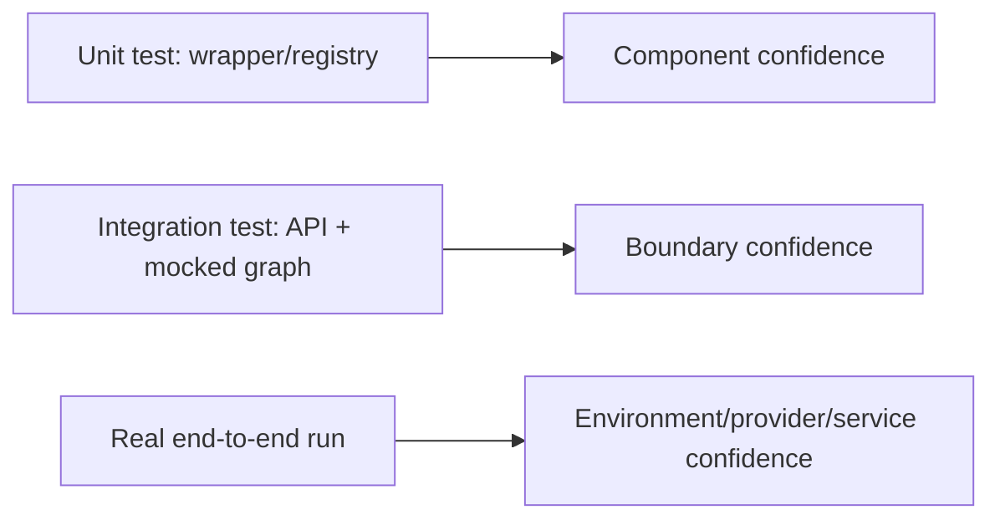
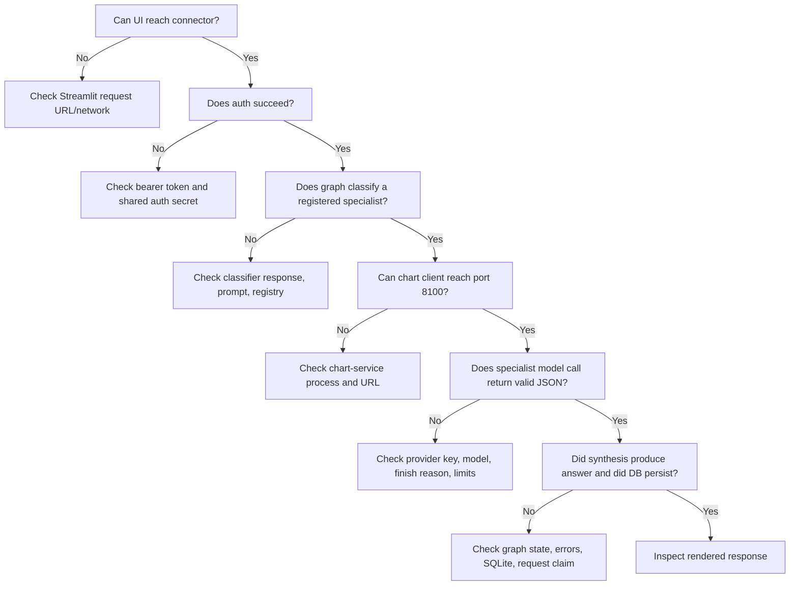
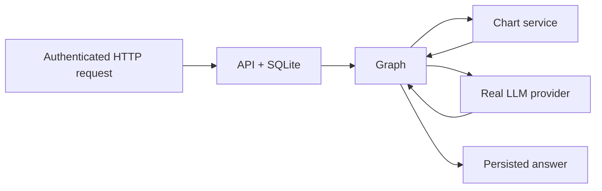

# 09. Tests and Running the Project

[Book home](../ASTROWEAVE_BOOK.md) | Previous: [08. Accounts and History](08-accounts-and-history.md) | Next: [10. Read the Source with Me](10-source-tour.md)

## The question this chapter answers

How do we know a component behaves as expected, what can a test prove, how are the services started, and where should we look when something fails?

## 1. Tests are checks of specific claims

A test is useful when you can say what claim it verifies. AstroWeave organizes tests into:

- `tests/unit/`: focused checks of small components and logic.
- `tests/integration/`: checks across a wider boundary, commonly the API with graph/DB dependencies controlled.



More arrows to the right involve more real components and more environmental variability. A mocked test is often faster and more deterministic; an end-to-end run proves more integration, but requires real services and credentials.

## 2. What representative tests prove

| Test | Example claim it checks | What it does not prove |
|---|---|---|
| `test_tools.py` | Decorated Python function is callable and enforces response type; registry lookup works. | LLM can select registered tools. |
| `test_agent_registry.py` | Built-in agent names and tool grouping are correct. | The specialist executor uses those tools. |
| `test_orchestrator_graph.py` | Task routing/stages/errors/synthesis behavior under controlled LLM responses. | Real provider output quality or remote chart service availability. |
| `test_specialist_graph.py` | Specialist graph builds model input and handles responses/errors. | Real-world astrology validity. |
| `test_conversation_store.py` | Ownership, history windows, claim/replay, and persistence behavior in SQLite. | Production database operations at scale. |
| `test_api.py` | HTTP behavior for API routes under mocked graph calls. | All downstream real services work together. |

A test can be green while a real credential is expired, an external provider is down, or a separately started service is missing.

## 3. Replacing dependencies with test doubles

A **mock** or **fake** stands in for a dependency. In a graph test, `get_llm` can be patched to return an object whose `.invoke(...)` returns preselected JSON. `execute_specialist` can be patched to return a controlled result.

This lets a test inspect behavior such as “career ran before love” without sending an LLM request or calculating a chart. It also means the test should not be described as a real LLM integration test.

When patching an imported function, patch the name where the code under test looks it up. For example, if `orchestrator_graph.py` did `from ... import get_llm`, patch that module's `get_llm` reference rather than the original defining module.

## 4. Running the focused tests

The repository tests use `unittest.TestCase` style and can run with Python's built-in test runner. From the project root:

```bash
PYTHONPATH=src python -m unittest tests.unit.test_tools tests.unit.test_agent_registry
```

Run the whole unit/integration test package with:

```bash
PYTHONPATH=src python -m unittest discover -s tests
```

The `pytest` command may also be used if pytest is installed, but it is not a runtime dependency in the core requirements by default. Use the project's active virtual environment/interpreter if one is configured.

A normal development sequence is:

1. Run the test nearest the changed code.
2. Run the larger relevant suite when the behavior spans components.
3. Run formatting/type/lint gates required by project configuration.
4. For network behavior, run an integration check with the relevant service available.

## 5. Local services and dependency boundaries

The usual development setup has several processes:

```text
Terminal A: chart_service on port 8100
Terminal B: connector API on port 8000
Terminal C: Streamlit UI on port 8501
```

The README contains the current install/start commands. A common shape is:

```bash
# Main app dependencies (use a virtual environment)
pip install -r requirements.txt

# Connector API
PYTHONPATH=src uvicorn astroweave.api.main:app --reload --port 8000

# In another terminal: UI
streamlit run app/streamlit_app.py

# In another environment/terminal: chart service
cd chart_service
pip install -r requirements.txt
uvicorn main:app --port 8100
```

The chart service has its own dependency environment because its PyJHora stack is isolated. The connector also needs a configured LLM provider package, API key, and environment settings for a real model call.

Check `.env.example`/README or the provider configuration code for current variable names. Do not paste real keys into documentation or commit them.

## 6. Health checks and what they mean

- Main connector: `GET /health` on port 8000.
- Chart service: `GET /health` on port 8100.
- Streamlit: request the root page on port 8501.

A health response proves only that that process handled its health endpoint. It does not test database write access, provider credentials, chart calculation, or specialist routing. A complete readiness check would need explicit dependency probes; these simple health endpoints do not make that promise.

## 7. Debug one real question systematically



Useful information includes the HTTP status/body, structured `state.errors`, application logs, and process/port status. Avoid logging passwords, bearer tokens, or provider API keys.

## 8. Common failure patterns

| Symptom | First checks |
|---|---|
| API health works but `/run` fails | Auth, provider key/package, chart service, request profile. |
| “Birth details required” | Account has saved birth details; profile date is usable by chart service. |
| Connection refused on chart | Chart service is running at the configured URL/port. |
| LLM provider/model error | Provider config precedence, installed optional SDK, API key, network. |
| Non-JSON specialist response | Logs show attempt count, response length, finish reason; check output token budget/model response. |
| HTTP 409 | Reused message ID with changed data or still-pending request claim. |
| HTTP 401 | Missing, invalid, expired, or differently signed bearer token. |
| API returns 200 but answer includes error | Inspect `state.errors`; some failures are deliberately recoverable graph outcomes. |
| Old behavior despite code edits | Confirm the process/port serving the request is the one just started; stale processes can remain bound. |

## 9. Configuration is layered

The app uses environment variables for provider/model settings, URLs, limits, and secrets. Values may be loaded from `.env.<environment>` and then environment variables. Provider/model settings can be overridden globally, per role, or per specialist; the most specific matching value wins.

When a configuration seems ignored, write down the exact lookup precedence and check for a more specific variable. For example, `ASTROWEAVE_LLM_MODEL_CAREER` overrides a generic model setting for career calls.

## 10. Mocked versus real end-to-end verification

A real test exercises boundaries in sequence:



Before concluding the integration works, verify which API process is actually bound to the port and which environment has the provider key. A stale API process can make a successful curl response misleading because it may be serving older code.

Use safe sample accounts/data. A real run may send birth chart data and conversation text to a configured third-party LLM provider; treat it as a privacy-relevant operation.

## 11. What the test suite cannot judge

Tests can establish that parsing, dispatch, persistence, and API behavior follow coded rules. They cannot prove that an astrological statement is true, that a model is unbiased, or that the application is production-secure. Those require separate domain, model-evaluation, privacy, security, and operational reviews.

## Continue

Next: [10. Read the Source with Me](10-source-tour.md), a file-by-file learning route. For exact setup variables and operations notes, see [README.md](../../README.md) and [PROJECT_DOCUMENTATION.md](../PROJECT_DOCUMENTATION.md).
