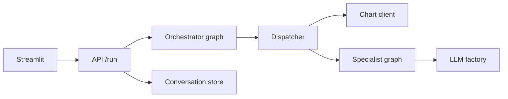
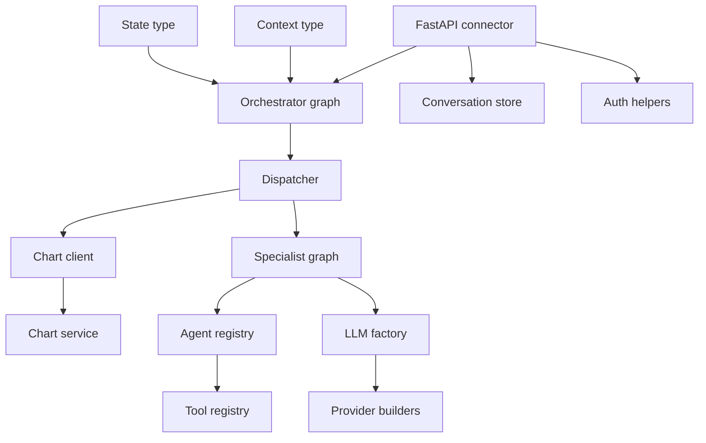

# 10. Read the Source with Me: A Guided Repository Tour

[Book home](../ASTROWEAVE_BOOK.md) | Previous: [09. Tests and Operations](09-testing-and-operations.md)

## The question this chapter answers

If I want to understand the real implementation instead of only reading explanations, what file should I open first, and how do I follow the execution without getting lost?

## 1. Choose a reading path

### Path A: follow a user question



Recommended order:

1. `app/streamlit_app.py`: locate the form submission and API request.
2. `src/astroweave/api/main.py`: locate `RunRequest`, authentication dependency, and `run(...)`.
3. `src/astroweave/graphs/orchestrator/orchestrator_graph.py`: find graph assembly and node implementations.
4. `src/astroweave/orchestration/dispatcher/dispatcher.py`: follow chart retrieval and specialist handoff.
5. `src/astroweave/graphs/specialist/specialist_graph.py`: follow the per-domain model request.
6. `src/astroweave/common/llm/`: follow configuration, provider construction, and JSON parsing.
7. Return to `api/main.py` and `common/conversation/store.py`: see final persistence and response.

### Path B: understand the “tool” word

1. `src/astroweave/common/tools/base.py`: abstract contract, executable wrapper, descriptive PromptTool, decorator.
2. `src/astroweave/common/tools/registry.py`: name-to-object storage and lookup.
3. `src/astroweave/agents/registry.py`: agent definition and agent catalog.
4. `src/astroweave/agents/specialists/__init__.py`: which objects are registered for each specialist.
5. `src/astroweave/agents/specialists/career/tools.py`: concrete prompt-only entries.
6. `src/astroweave/graphs/specialist/specialist_graph.py`: confirm the executor reads `agent.prompt` but not `agent.tools`.
7. `src/astroweave/orchestration/dispatcher/dispatcher.py`: find the direct Python call to the chart client and graph invocation.
8. `tests/unit/test_tools.py`: confirm what the wrappers actually do.

## 2. Follow a symbol, not a file name

A useful source-tracing technique is to follow the same name across definition, import, and call site:

```text
Definition: where is the function/class created?
Import:     which module brings that name into scope?
Call:       which expression actually uses it?
Consumer:   who reads the value it returns?
```

For the chart path:

```text
get_birth_chart defined in common/tools/chart_client.py
  -> imported by orchestration/dispatcher/dispatcher.py
  -> called in _get_chart_data(...)
  -> response dictionary returned and saved in graph state
  -> chart_data passed into specialist handoff
```

For a FunctionTool test:

```text
tool() decorator defined in common/tools/base.py
  -> wraps a test function into FunctionTool
  -> test calls that wrapper with parentheses
  -> __call__ forwards to invoke()
  -> invoke() calls wrapped function and checks response class
```

The first path crosses HTTP to a separate service. The second is a direct in-process Python call. Neither currently starts because an LLM selects the action.

## 3. Distinguish graph assembly from graph execution

Search for `build_orchestrator_graph` and read two regions separately:

- **Assembly:** `StateGraph(...)`, `add_node(...)`, `add_edge(...)`, `add_conditional_edges(...)`, `compile()`.
- **Execution:** `_resolve_conversation_context`, `_classify_request`, `_plan_specialist_tasks`, `_run_stage`, `_synthesize_response`.

The assembly tells you the path options. The functions tell you what actually happens at each point. A Mermaid diagram helps visualize edges, but the Python implementation controls behavior.

## 4. Read the API as an outer boundary

In `src/astroweave/api/main.py`, orient yourself in this sequence:

1. Imports and `FastAPI(...)` construction.
2. `_orchestrator_graph = build_orchestrator_graph()` (graph compiled once at module import).
3. Pydantic request models such as `RunRequest`.
4. Auth routes and `authenticated_username` dependency.
5. Conversation endpoints.
6. Fingerprinting/direct route helpers.
7. `/run` authentication, claim, history loading, graph invocation, persistence, and response.

This file is large because it coordinates the HTTP boundary and transcript lifecycle. It is not where the specialist's astrology analysis is implemented.

## 5. Read the orchestrator in layers

In `orchestrator_graph.py`, read from the inside outward:

1. `logger` and imports show dependencies.
2. Node functions contain each operation.
3. `_route_after_context_resolution` and `_route_stage` decide transitions.
4. `build_orchestrator_graph` registers the workflow.

Focus on values returned by each node. A node returning `{"errors": [...]}` updates graph state; a conditional route may then choose synthesis. For each LLM call, identify the prompt constant and message content.

## 6. Read the dispatcher as the handoff boundary

In `dispatcher.py`, useful symbols are:

- `_get_specialist_graph()`: lazily builds/caches the compiled shared specialist graph.
- `_get_chart_data(...)`: reads birth details, calls chart client, catches HTTP failures.
- `execute_specialist(...)`: creates a handoff dictionary, applies context limit, chooses local graph versus configured HTTP endpoint, catches failure, extracts results/errors.
- `run_dispatcher(...)`: older compatibility wrapper that iterates all specialists.

This file is where the phrase “handoff to a specialist” has a very concrete meaning: data is assembled, then another Python function/graph is invoked locally or an HTTP request is sent remotely.

## 7. Read a node by annotating each statement

For a node such as `_executor`, make a small table in your notes:

| Source expression | Plain meaning |
|---|---|
| `specialist_name = state.get("current_task", "")` | Read selected specialist name, falling back to empty text. |
| `agent = SPECIALIST_REGISTRY.get(specialist_name)` | Look up allowed agent definition. |
| `if agent is None` | Stop safely when name is unknown. |
| `user_content = (...)` | Build text/data sent as the task message. |
| `llm = get_llm(...)` | Construct configured model wrapper. |
| `invoke_json_response(...)` | Call the model and parse/retry JSON. |
| `return {"specialist_results": [...]}` | Hand structured result back to the graph runtime. |

Now repeat this for any unfamiliar function. It turns a dense source file into a sequence of inputs, actions, and outputs.

## 8. Use tests to learn the intended contract

A source function may have branches that are hard to understand. Its tests often provide small example inputs and expected outputs:

- `tests/unit/test_tools.py`: tool wrapper, metadata, type enforcement, prompt-only failure.
- `tests/unit/test_agent_registry.py`: agent names, per-agent registries, duplicate handling.
- `tests/unit/test_orchestrator_graph.py`: routes, stage order, cycle rejection, failures.
- `tests/unit/test_specialist_graph.py`: specialist output and unknown agent behavior.
- `tests/unit/test_dispatcher.py`: chart and local/remote specialist behavior.
- `tests/unit/test_conversation_store.py`: history, ownership, claims, replay, deletion.
- `tests/integration/test_api.py`: API contract with downstream execution controlled.

Tests are executable examples, but inspect their mocks: a mocked dependency is not being tested as a real service.

## 9. A dependency map for common concepts



The line from specialist graph to tool registry represents the agent definition containing a registry. The current executor does not traverse that line to call a tool; the diagram shows structural ownership, not a live tool loop.

## 10. Search patterns that answer practical questions

| Question | Search for |
|---|---|
| Where is a workflow built? | `StateGraph`, `add_node`, `add_edge`, `compile` |
| What actually calls a model? | `get_llm`, `.invoke(`, `invoke_json_response` |
| How does the chart cross a process boundary? | `get_birth_chart`, `httpx.post`, `@app.post("/chart")` |
| How are tool wrappers invoked? | `FunctionTool`, `def __call__`, `self._function(*args, **kwargs)` |
| Is an LLM tool loop connected? | `bind_tools`, `ToolNode`, `tool_calls`, uses of `agent.tools` |
| How are recoverable failures returned? | `errors`, `try:`, `except`, `raise_for_status` |
| Who writes the final transcript? | `persist_turn`, `conversation_messages` |

A missing search result can be informative, but do not rely only on search: inspect the code path that would have to use that behavior.

## 11. Source-guide cautions

- A docstring says what a function is intended to do; inspect its body to confirm current behavior.
- A type annotation describes intent; it may not perform runtime validation.
- A test mock can make a missing server appear irrelevant to a unit test.
- A class may be registered but unused.
- An environment variable can override a default, sometimes at a more specific role/agent level.
- A graph node can be a no-op even when its name sounds active.
- The same `.invoke` spelling is used on graph, model, and tool wrapper objects.

## 12. Your own trace exercise

Try this with no API key needed:

1. Open `tests/unit/test_tools.py` and find the decorated `career_focus` function.
2. Follow `@tool(...)` into `base.py`.
3. Find why the test's `career_focus("growth")` call works.
4. Change the return value in your understanding to a plain dictionary. Which line rejects it?
5. Now inspect the specialist executor. Does it retrieve `career_focus` or any other registry entry?
6. Compare with `get_birth_chart(...)` in the dispatcher. Which Python line calls that function?

You should end with two distinct observations: the test directly calls a wrapper; the dispatcher directly calls a chart client; neither is an LLM choosing an action.

## 13. What to read after the book

- [PROJECT_DOCUMENTATION.md](../PROJECT_DOCUMENTATION.md): concise engineering contract, current status, API/configuration/security/operations details.
- [README.md](../../README.md): local development start commands and top-level architecture.
- `PROJECT_CONTEXT.md`: compact workspace notes, not the canonical user-facing reference.
- Tests adjacent to any code you change.

## Final model of the whole system

```text
UI collects the question.
API authenticates, loads history/profile, and starts a graph.
Graph nodes are Python functions connected by LangGraph.
Python explicitly calls the configured LLM and the chart HTTP client.
LLM returns generated content; chart service returns calculated data.
Python validates/combines those results, persists the final turn, and responds.
```

For an LLM-directed specialist function call, the relay would need additional explicit code that exposes schemas, receives structured call requests, validates and invokes approved functions, and sends tool results back. That is not yet part of the current specialist graph.
